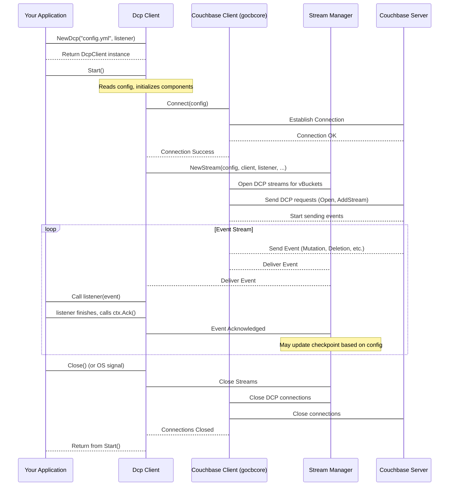

# Chapter 1: Dcp Client

Welcome to the `go-dcp` tutorial! In this first chapter, we'll meet the central piece of the `go-dcp` library: the **Dcp Client**.

Think of the Dcp Client as the **control panel** or **orchestrator** for your connection to Couchbase's Database Change Protocol (DCP). It's the main thing you'll interact with to tell `go-dcp` what you want to do.

But why do we need this "control panel"?

Couchbase DCP is a powerful way to get a real-time stream of every change happening in your database (documents being added, modified, or deleted). Setting this up involves several steps: connecting securely, figuring out which parts of the database you need to listen to, keeping track of where you stopped receiving events (so you can resume later), and managing the connection itself.

Doing all this manually can be complicated. The `go-dcp` library is here to simplify this by providing the `Dcp Client`. It handles all the complex details behind the scenes, letting you focus on what you want to *do* with the change events you receive.

Let's look at the most common thing you'll want to do: **get all the changes from your Couchbase bucket and process them.**

This is the basic use case the `Dcp Client` is designed for.

## How to Use the Dcp Client

Getting started with the `Dcp Client` is straightforward. You typically need two things:

1.  **Configuration:** Details about how to connect to your Couchbase cluster (hosts, username, password, bucket name, etc.). This is usually provided in a file (like `config.yml`).
2.  **A Listener Function:** Your Go code that will be called every time `go-dcp` receives a change event (a mutation, deletion, or expiration) from Couchbase.

Here's the minimal Go code to create and start the Dcp Client, taken directly from the `go-dcp` README example:

```go
package main

import (
	"github.com/Trendyol/go-dcp"
	"github.com/Trendyol/go-dcp/logger" // For logging
	"github.com/Trendyol/go-dcp/models" // For event types
)

// This function will be called for each change event
func listener(ctx *models.ListenerContext) {
	switch event := ctx.Event.(type) {
	case models.DcpMutation:
		logger.Log.Info("Mutation received for document ID: %v", string(event.Key))
		// You would process the mutation event here
	case models.DcpDeletion:
		logger.Log.Info("Deletion received for document ID: %v", string(event.Key))
		// You would process the deletion event here
	case models.DcpExpiration:
		logger.Log.Info("Expiration received for document ID: %v", string(event.Key))
		// You would process the expiration event here
	}

	// It's important to acknowledge the event
	ctx.Ack()
}

func main() {
	// 1. Create the Dcp Client
	// We pass the config file path and our listener function
	connector, err := dcp.NewDcp("config.yml", listener)
	if err != nil {
		// Handle the error if connection fails
		panic(err)
	}

	// 2. Ensure the client is closed when main exits
	defer connector.Close()

	// 3. Start the DCP stream!
	connector.Start()

	// The program will now block and process events via the listener function
	// until interrupted (e.g., Ctrl+C) or connector.Close() is called elsewhere
}
```

Let's break down the key parts:

```go
func listener(ctx *models.ListenerContext) {
	// ... process events ...
	ctx.Ack()
}
```

This is **your** code that handles the incoming events. The `Dcp Client` receives change events from Couchbase and passes them one by one to this function. The `ctx *models.ListenerContext` contains the event data and other useful information. You'll learn more about the [Consumer / Listener](03_consumer___listener_.md) in a later chapter.

It's crucial to call `ctx.Ack()` after you have successfully processed an event. This tells `go-dcp` that you are done with this event and it can keep track of your progress, which is important for [Checkpointing](06_checkpoint_.md).

```go
connector, err := dcp.NewDcp("config.yml", listener)
```

This line creates the `Dcp Client` instance.
*   `"config.yml"`: This points to a file containing all the necessary [Configuration](02_configuration_.md) details for connecting to Couchbase and setting up the DCP stream.
*   `listener`: This is the function *you* provided that will process the incoming events.

If there's a problem creating the client (e.g., invalid config or cannot connect), `err` will be non-nil.

```go
defer connector.Close()
```

This ensures that when your `main` function finishes (either successfully or due to an error/signal), the `Dcp Client` connection to Couchbase is properly closed and resources are cleaned up.

```go
connector.Start()
```

This is the command that tells the `Dcp Client` to **connect to Couchbase and begin streaming change events**. Once `Start()` is called, the client will connect, identify the relevant vBuckets (partitions of data in Couchbase), start streaming from them, and call your `listener` function for each event it receives. This call is blocking, meaning your program will stay inside `connector.Start()` until the client is stopped (e.g., by an OS signal or calling `connector.Close()`).

## Behind the Scenes

When you call `dcp.NewDcp` and then `connector.Start()`, the `Dcp Client` orchestrates several actions. Let's look at a simplified flow:



As you can see, the `Dcp Client` is the conductor of this orchestra. It uses several other components internally:

*   A wrapper around Couchbase's low-level Go client ([Couchbase Client](04_couchbase_client__gocbcore_wrapper__.md)) to handle the actual network communication and DCP protocol details.
*   A [Stream](05_stream_.md) manager to handle starting, stopping, and managing the flow of events for different parts of your data (vBuckets).
*   A [Checkpoint](06_checkpoint_.md) system to keep track of your progress so you can resume the stream correctly if your application stops and restarts.
*   Potentially, components for [Membership / VBucket Discovery](09_membership___vbucket_discovery_.md) if you're running multiple instances of your application to distribute the workload.

The `Dcp Client` brings all these pieces together based on the [Configuration](02_configuration_.md) you provide and routes the incoming events to your [Consumer / Listener](03_consumer___listener_.md) code.

## Conclusion

In this chapter, you learned that the `Dcp Client` is the main entry point for using the `go-dcp` library. It acts as an orchestrator, handling the complex task of connecting to Couchbase DCP and managing the stream of change events. You saw the minimal code required to create and start the client, providing it with configuration and your own event listener function.

You also got a glimpse of the internal workings, understanding that the `Dcp Client` coordinates several other components to deliver events to your application.

Now that you understand the role of the `Dcp Client`, the next step is to dive into how you configure it.

Let's move on to the next chapter: [Configuration](02_configuration_.md).

---

<sub><sup>Generated by [AI Codebase Knowledge Builder](https://github.com/The-Pocket/Tutorial-Codebase-Knowledge).</sup></sub> <sub><sup>**References**: [[1]](https://github.com/Trendyol/go-dcp/blob/f83516164dfbcc3050230193a865f051a4097d0e/README.md), [[2]](https://github.com/Trendyol/go-dcp/blob/f83516164dfbcc3050230193a865f051a4097d0e/dcp.go), [[3]](https://github.com/Trendyol/go-dcp/blob/f83516164dfbcc3050230193a865f051a4097d0e/example/grafana/main.go), [[4]](https://github.com/Trendyol/go-dcp/blob/f83516164dfbcc3050230193a865f051a4097d0e/example/main.go)</sup></sub>