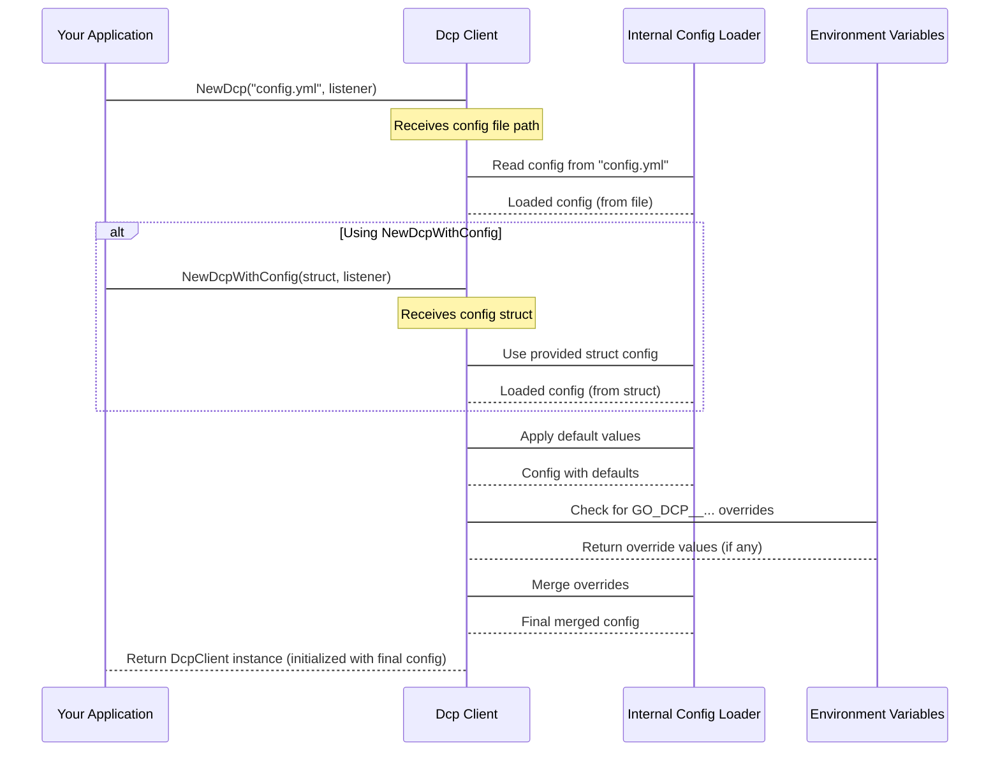

# Chapter 2: Configuration

In the [previous chapter](01_dcp_client_.md), we introduced the **Dcp Client** as the central control panel for `go-dcp`. You saw how to create a client by giving it a configuration file path and your event listener function.

But what exactly *is* this configuration? And why do we need it?

Think of the `Dcp Client` as a smart assistant that needs clear instructions. It needs to know:

*   **Where** is the Couchbase cluster you want to connect to?
*   **How** should it authenticate (username, password, security settings)?
*   **Which** specific data (bucket, scope, collections) should it listen to?
*   **How** should it manage tracking progress so it can resume correctly if it stops?
*   **What** other advanced settings are needed (like buffer sizes, logging levels, or how to work with other instances of your application)?

The **Configuration** in `go-dcp` is the **blueprint** or **instruction manual** that provides all these details to the `Dcp Client`. It tells the client exactly how it should behave, connect, and manage the DCP stream.

Without configuration, the `Dcp Client` wouldn't know where to go or what to do!

## Providing Configuration

`go-dcp` is flexible. You can provide this blueprint in a couple of ways:

1.  **YAML File:** This is the most common and often easiest way, especially for static configurations. This is what you saw in Chapter 1.
2.  **Go Struct:** You can create and populate a Go struct (`config.Dcp`) directly in your code. This is useful if your configuration is generated dynamically.
3.  **Environment Variables:** These can be used to override specific settings from the YAML file or Go struct, which is very handy in different deployment environments (like development vs. production).

The `Dcp Client` loads the configuration by combining these sources, with environment variables taking the highest priority.

## Configuration Details: The Blueprint Items

The configuration covers many aspects of the `go-dcp` client's behavior. Here are some of the key areas you'll configure:

| Area                       | What it Configures                                               |
| :------------------------- | :--------------------------------------------------------------- |
| **Connection**             | Couchbase cluster hosts, username, password, secure connections. |
| **Data Filtering**         | Which `bucket`, `scope`, and `collections` to stream changes from. |
| **DCP Stream Settings**    | Internal buffer sizes, connection timeouts, queue sizes.         |
| **Checkpointing**          | How `go-dcp` saves its progress (e.g., to Couchbase or a file) and how often. |
| **Membership/Grouping**    | How multiple instances of your application can share the workload (covered in a later chapter). |
| **Rollback Mitigation**    | Handling potential data inconsistencies after cluster changes.     |
| **Health Checks**          | Configuring internal checks to monitor the client's state.       |
| **API**                    | Enabling and configuring a built-in HTTP API for metrics or status. |
| **Logging**                | Setting the logging level (`info`, `debug`, etc.).               |

Let's look at the most common way to provide this information: using a YAML file.

## Using a Configuration File (YAML)

As seen in Chapter 1, the simplest way to get started is with a `config.yml` file. Here's a minimal example from the `go-dcp` examples:

```yaml
# example/config.yml
hosts:
  - localhost:8091
username: user
password: 123456
bucketName: dcp-test
logging:
  level: info
dcp:
  group:
    name: groupName
```

This small file tells `go-dcp`:

*   `hosts`: Connect to Couchbase at `localhost:8091`.
*   `username` and `password`: Use these credentials for authentication.
*   `bucketName`: Stream changes from the `dcp-test` bucket.
*   `logging.level`: Set the logging level to `info` (you'll see informative messages).
*   `dcp.group.name`: Give this client instance the group name `groupName`. (More on groups in the [Membership chapter](09_membership___vbucket_discovery_.md)).

In your Go code from Chapter 1, you passed the path to this file:

```go
// ... (listener function remains the same) ...

func main() {
	// Create the Dcp Client, passing the config file path
	connector, err := dcp.NewDcp("config.yml", listener)
	if err != nil {
		panic(err) // Handle config loading or connection error
	}

	defer connector.Close()
	connector.Start()
}
```

When `dcp.NewDcp("config.yml", ...)` is called, `go-dcp` reads this file, parses the YAML content, and internally creates the configuration blueprint it needs.

## Using a Go Struct

Instead of a file path, you can also pass a pre-populated `config.Dcp` struct to the client using `dcp.NewDcpWithConfig`. This is useful if you're getting configuration from a different source (like a database, command-line flags, or another configuration library).

Here's how you might do that with a minimal configuration:

```go
package main

import (
	"github.com/Trendyol/go-dcp"
	"github.com/Trendyol/go-dcp/config" // Import the config package
	"github.com/Trendyol/go-dcp/logger"
	"github.com/Trendyol/go-dcp/models"
	"time"
)

// Listener function (same as before)
func listener(ctx *models.ListenerContext) {
	switch event := ctx.Event.(type) {
	case models.DcpMutation:
		logger.Log.Info("Mutation: %v", string(event.Key))
	case models.DcpDeletion:
		logger.Log.Info("Deletion: %v", string(event.Key))
	case models.DcpExpiration:
		logger.Log.Info("Expiration: %v", string(event.Key))
	}
	ctx.Ack()
}

func main() {
	// 1. Create a config.Dcp struct
	cfg := &config.Dcp{
		Hosts:      []string{"localhost:8091"},
		Username:   "user",
		Password:   "123456",
		BucketName: "dcp-test",
		Logging: config.Logging{
			Level: logger.INFO, // Use the logger constant
		},
		Dcp: config.ExternalDcp{ // Required nested struct
			Group: config.DCPGroup{ // Required nested struct
				Name: "myGoStructGroup",
			},
			ConnectionTimeout: time.Minute, // Example of setting a timeout
		},
		Checkpoint: config.Checkpoint{ // Example checkpoint settings
			Type: "auto",
			Interval: time.Minute,
		},
	}

	// 2. Create the Dcp Client using the struct
	connector, err := dcp.NewDcpWithConfig(cfg, listener)
	if err != nil {
		panic(err)
	}

	// ... (rest is the same) ...
	defer connector.Close()
	connector.Start()
}
```

In this case, you're manually building the `cfg` struct and providing it to `dcp.NewDcpWithConfig`. The effect is the same as loading from the YAML file – the client gets the blueprint it needs. Notice that some fields (like `Dcp` and `Dcp.Group`) are nested structs that must be initialized, even if just with default values or required fields like the group name.

## Environment Variable Overrides

Environment variables provide a powerful way to change configuration without touching your code or configuration files. `go-dcp` follows a specific naming convention for environment variables: `GO_DCP__` followed by the uppercase, underscore-separated path to the configuration field.

For example, to override the `dcp.group.membership.totalMembers` setting from the YAML or struct, you would set the environment variable `GO_DCP__DCP_GROUP_MEMBERSHIP_TOTALMEMBERS`.

Let's say your YAML config has `dcp.group.membership.totalMembers: 1`. If you run your application with `GO_DCP__DCP_GROUP_MEMBERSHIP_TOTALMEMBERS=5`, the client will use `5` for that setting, ignoring the value in the YAML file.

This layering (Struct/File -> Environment Variables) gives you flexibility in managing configuration.

## How Configuration Works Internally

When you call `dcp.NewDcp` (with a file path) or `dcp.NewDcpWithConfig` (with a struct), here's a simplified view of what happens regarding configuration:



Essentially, the `Dcp Client`'s internal configuration logic performs these steps:

1.  Loads the initial configuration, either from the specified YAML file or the provided struct.
2.  Applies a set of default values for any settings not present in the initial configuration. This ensures the client always has valid settings even if your config is minimal. (You can see examples of this in the `ApplyDefaults` method in the `config/dcp.go` source code).
3.  Checks for environment variables starting with `GO_DCP__` and applies any matching values, overriding the file/struct and default values.
4.  The final, merged configuration is used to initialize all the other components of the `go-dcp` client, such as the [Couchbase Client](04_couchbase_client__gocbcore_wrapper__.md), the [Stream](05_stream_.md) manager, the [Checkpoint](06_checkpoint_.md) system, etc.

This multi-stage loading process makes `go-dcp` configurations both easy to use with simple files and flexible for more complex or dynamic deployment scenarios.

## Conclusion

In this chapter, you learned that configuration is the essential blueprint for the `go-dcp` client, telling it how to connect, stream, and manage its state. You saw how to provide this configuration using the common YAML file approach (as used in Chapter 1) and the alternative Go struct method. You also learned about the powerful environment variable override mechanism.

Understanding configuration is key because it dictates how your `go-dcp` application will interact with your Couchbase cluster and manage the change stream.

Now that you know how to configure the client, let's look at the code you write to actually *process* the changes it receives – the **Consumer / Listener**.

[Chapter 3: Consumer / Listener](03_consumer___listener_.md)
