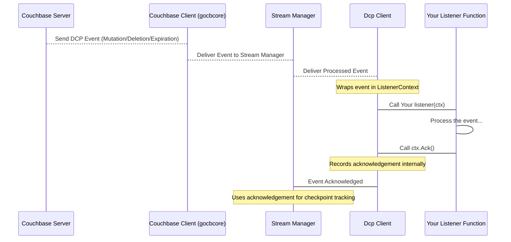

# Chapter 3: Consumer / Listener

In the [previous chapter](02_configuration_.md), we learned that the `Dcp Client` needs **Configuration** to know *how* and *where* to connect to Couchbase and what data to stream.

But once the `Dcp Client` successfully connects and starts receiving the stream of changes from Couchbase, what does it *do* with them? This is where the **Consumer / Listener** comes in.

Think of the `Dcp Client` as a mail delivery service that collects all the mail (change events) from the post office (Couchbase DCP). The **Consumer / Listener** is **your mailbox** and **your process for handling the mail**. It's the part of *your* code that the `go-dcp` library calls every time a piece of mail (an event) arrives.

Its primary job is simple: **define how to process the actual change events** – the documents being added, modified, or deleted.

## The Simplest Way: The `Listener` Function

As you saw briefly in Chapter 1, the most basic way to handle events is by providing a simple Go function. In `go-dcp`, this is called a `Listener`.

A `Listener` function has a specific signature:

```go
func myListenerFunction(ctx *models.ListenerContext) {
	// Your code to process the event goes here
	// ...

	// IMPORTANT: Acknowledge the event when done
	ctx.Ack()
}
```

Let's break down the key parts:

1.  **`func myListenerFunction(...)`**: This is just a standard Go function. You can name it whatever you like (like `listener` in the Chapter 1 example).
2.  **`ctx *models.ListenerContext`**: This is the crucial input. `go-dcp` passes a `ListenerContext` pointer to your function for *each* event it receives. This context contains everything you need to know about the event and how to interact with `go-dcp` regarding this event.

## Inside the `ListenerContext`

The `models.ListenerContext` struct (defined in `models/listeners.go`) is simple but important. The most relevant fields for a basic listener are:

*   **`Event interface{}`**: This field holds the actual change event data received from Couchbase. It's an `interface{}` because the event can be one of several types (Mutation, Deletion, Expiration). You'll need to check its underlying type.
*   **`Ack func()`**: This is a function *provided by `go-dcp`*. Calling `ctx.Ack()` is how you tell the library that you have successfully processed the event contained in this context. This is vital for [Checkpointing](06_checkpoint_.md).

## Processing Events with the `Listener`

The most common pattern inside your `Listener` function is to check the type of the `Event` and handle it accordingly. The possible event types you'll typically see are:

*   `models.DcpMutation`: A document was created or updated.
*   `models.DcpDeletion`: A document was deleted.
*   `models.DcpExpiration`: A document expired and was automatically removed.

Here's how you check the type, using a `switch` statement as shown in the examples:

```go
func listener(ctx *models.ListenerContext) {
	// Check the type of the event
	switch event := ctx.Event.(type) {
	case models.DcpMutation:
		// Handle a document mutation (create or update)
		// `event` is now of type models.DcpMutation
		logger.Log.Info("Mutation received for document ID: %v", string(event.Key))
		// You can access event details like:
		// event.Key   ([]byte) - The document ID
		// event.Value ([]byte) - The document content (for mutations)
		// event.VbID  (uint16) - The vBucket ID
		// event.SeqNo (uint64) - The sequence number for this change
		// ... and others

	case models.DcpDeletion:
		// Handle a document deletion
		// `event` is now of type models.DcpDeletion
		logger.Log.Info("Deletion received for document ID: %v", string(event.Key))
		// Access details like event.Key, event.VbID, event.SeqNo etc.

	case models.DcpExpiration:
		// Handle a document expiration
		// `event` is now of type models.DcpExpiration
		logger.Log.Info("Expiration received for document ID: %v", string(event.Key))
		// Access details like event.Key, event.VbID, event.SeqNo etc.

	default:
		// Handle other potential event types (less common for basic use)
		logger.Log.Warn("Received unknown event type: %T", event)
	}

	// ALWAYS call Ack() after processing the event!
	ctx.Ack()
}
```

This `switch` pattern is standard and easy to use. You put *your* logic for processing each type of change inside the corresponding `case` block. This might involve saving the document to another database, updating a search index, triggering a notification, etc.

## The Importance of `ctx.Ack()`

Let's re-emphasize this: **Calling `ctx.Ack()` is crucial!**

```go
// ... after processing the event ...
ctx.Ack() // <-- Don't forget this!
```

What does `Ack()` do? It signals to the `go-dcp` library that you have successfully processed the event associated with this specific `ListenerContext`.

Why is this important?

`go-dcp` needs to keep track of how far along the DCP stream you are for each part of the data (each vBucket). This tracking is called [Checkpointing](06_checkpoint_.md). If your application stops and restarts, `go-dcp` uses the latest checkpoint to resume streaming from the correct position, ensuring you don't miss events and don't re-process events unnecessarily.

By calling `ctx.Ack()`, you are essentially telling `go-dcp`, "I'm done with this event. You can record that I processed up to this point (or a recent point influenced by this event's sequence number)." `go-dcp` accumulates acknowledgements and periodically saves the latest sequence numbers for the vBuckets you're processing.

**If you *don't* call `ctx.Ack()` for an event:** `go-dcp` will not consider that event processed. Depending on your [Checkpointing](06_checkpoint_.md) configuration, this can lead to issues:

*   The checkpoint might not advance correctly.
*   If your application restarts, `go-dcp` might resume *before* the event you failed to acknowledge, causing you to receive and potentially re-process it (and subsequent events) again.

So, make `ctx.Ack()` the last thing you do for each event you successfully handle!

## Using the `Listener` with the `Dcp Client`

As seen in Chapter 1, you pass your `Listener` function directly to `dcp.NewDcp`:

```go
// In your main function or setup code
connector, err := dcp.NewDcp("config.yml", listenerFunction) // Pass your function here
if err != nil {
	// Handle error
}
// ... rest of client setup and Start()
```

When `connector.Start()` is called, `go-dcp` will start receiving events and invoke `listenerFunction` for each one.

## A More Advanced Option: The `Consumer` Interface

While the `Listener` function is perfect for many use cases, `go-dcp` also provides a more flexible option: the `Consumer` interface.

```go
// Defined in models/listeners.go
type Consumer interface {
	ConsumeEvent(ctx *ListenerContext)
	TrackOffset(vbID uint16, offset *Offset)
}
```

An object that implements the `Consumer` interface can be provided to the `Dcp Client`. This offers more control and allows you to manage state or resources across event processing calls.

Let's look at its methods:

1.  **`ConsumeEvent(ctx *models.ListenerContext)`**: This method is functionally equivalent to the `Listener` function. It receives the same `ListenerContext` and is where you put your event processing logic. **You still need to call `ctx.Ack()` inside this method** after processing the event.
2.  **`TrackOffset(vbID uint16, offset *models.Offset)`**: This method is for advanced scenarios, primarily related to [Checkpointing](06_checkpoint_.md). It's called by `go-dcp` to provide you with the latest processed sequence number (`offset.SeqNo`) for a specific vBucket (`vbID`) *after* `Ack()` has been processed internally by `go-dcp` and it's ready to potentially save checkpoint data. This allows you to hook into the checkpointing process or implement custom offset tracking logic if needed. **For most beginners, you can often leave this method empty or simply log the information.** The standard `ctx.Ack()` handles the primary checkpointing flow.

## Why Use a `Consumer`?

You might choose to implement a `Consumer` instead of a simple `Listener` function if:

*   Your event processing logic requires shared state (e.g., a database connection pool, a counter, configuration settings) that needs to be initialized when the consumer is created and potentially cleaned up later.
*   You want to use Go receiver methods for your processing logic.
*   You need more fine-grained control or visibility into the checkpointing process via the `TrackOffset` method.

For a beginner, the `Listener` function is usually sufficient and simpler. The `Consumer` interface is there when you need more structure or advanced features.

## Using the `Consumer` with the `Dcp Client`

If you implement a type that satisfies the `models.Consumer` interface, you pass an instance of it to the `Dcp Client` using slightly different constructor functions:

```go
// Assuming you have a type MyConsumer that implements models.Consumer
myConsumerInstance := &MyConsumer{ /* initialize fields */ }

// Using configuration file:
connector, err := dcp.NewExtendedDcp("config.yml", myConsumerInstance)
if err != nil { /* handle error */ }

// Using configuration struct:
cfg := &config.Dcp{ /* populate config */ }
connector, err := dcp.NewExtendedDcp(cfg, myConsumerInstance)
if err != nil { /* handle error */ }

// ... rest of client setup and Start()
```

The `Dcp Client` will then call the `ConsumeEvent` method of your `myConsumerInstance` for each event, and potentially `TrackOffset`.

## How it Works Internally

Let's visualize the simple flow using the `Listener` function:



When `go-dcp` receives an event from Couchbase via the lower layers ([Couchbase Client (gocbcore wrapper)](04_couchbase_client__gocbcore_wrapper__.md) and [Stream](05_stream_.md)), the `Dcp Client` component takes that event and puts it into a `models.ListenerContext`. It then calls your registered `Listener` function (or the `ConsumeEvent` method of your `Consumer`), passing this context. Your function performs its task and calls `ctx.Ack()`, which notifies the `Dcp Client` that it's done. The `Dcp Client` then internally updates its tracking information, potentially leading to a checkpoint update later.

The `Consumer` follows a very similar flow for `ConsumeEvent`, just wrapped in a method call on your object. The `TrackOffset` method adds an extra call *from* the `DcpClient` back to your `Consumer` after an acknowledgement has been processed internally.

## Listener vs. Consumer: A Quick Comparison

| Feature          | `Listener` Function (`func(*models.ListenerContext)`) | `Consumer` Interface (`models.Consumer`)                |
| :--------------- | :------------------------------------------------------ | :------------------------------------------------------ |
| **Simplicity**   | Very simple, just a function                            | Requires defining a type and implementing methods       |
| **State Mgmt**   | Stateless per call (can access global/closure state)    | Can easily manage internal state within the struct      |
| **Event Handling** | Single function `listener(ctx)`                       | Single method `ConsumeEvent(ctx)`                     |
| **Offset Mgmt**  | Indirect via `ctx.Ack()`                                | Direct access via `TrackOffset` method (advanced)       |
| **Use Case**     | Most common scenarios, simple processing                | Complex processing, stateful consumers, custom tracking |

For most users starting out with `go-dcp`, the `Listener` function is the easiest and recommended approach.

## Conclusion

In this chapter, you learned about the **Consumer / Listener**, the part of your code that `go-dcp` calls to process the incoming change events. You saw how to use the simple `Listener` function and the slightly more advanced `Consumer` interface. Crucially, you understood the vital role of calling `ctx.Ack()` to acknowledge processed events and allow `go-dcp` to manage [Checkpointing](06_checkpoint_.md).

This component is where the core logic of *your* application resides – what you actually *do* with the data changes from Couchbase.

Now that you know how to configure the client and handle the events, let's peek behind the curtain at how `go-dcp` actually talks to Couchbase.

[Chapter 4: Couchbase Client (gocbcore wrapper)](04_couchbase_client__gocbcore_wrapper__.md)

