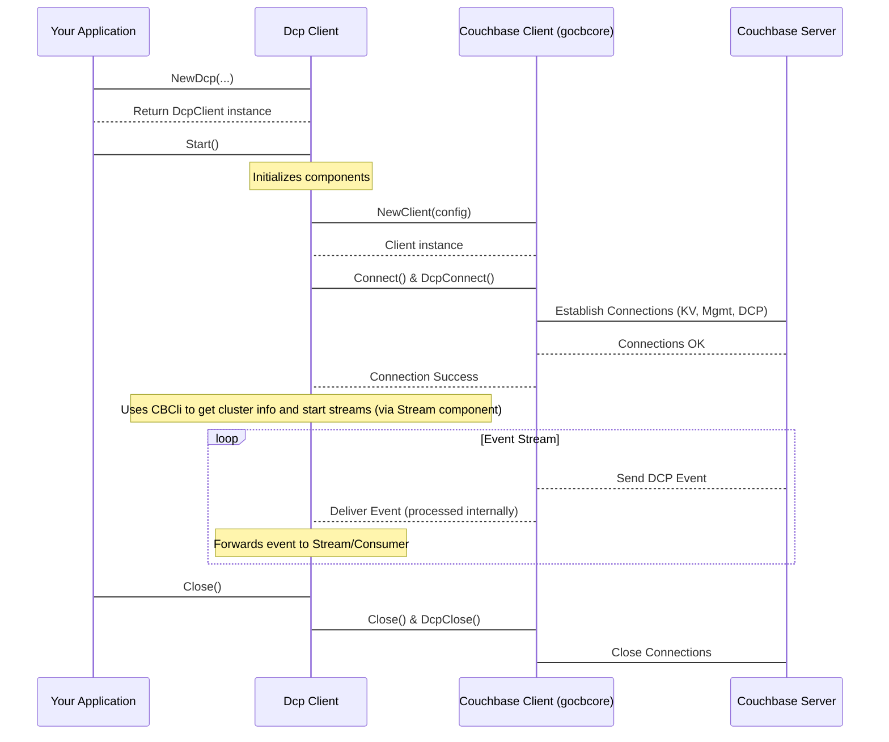

# Chapter 4: Couchbase Client (gocbcore wrapper)

In the [previous chapter](03_consumer___listener_.md), we explored the **Consumer / Listener**, which is *your* code responsible for processing the change events received from Couchbase. We saw that the [Dcp Client](01_dcp_client_.md) calls your listener function whenever an event arrives.

But how do those events actually get from the Couchbase cluster *to* the `go-dcp` library? This is the job of the **Couchbase Client (gocbcore wrapper)** component.

Think of the `Dcp Client` as the captain of a ship, and your **Consumer / Listener** as the crew member who processes the cargo (events) as it's unloaded. The **Couchbase Client** is the **ship's engine and communications system**. It's the component that directly interacts with the "sea" (the network) to connect to the "port" (Couchbase cluster) and load the "cargo" (DCP events).

It's the **direct bridge** between the `go-dcp` logic running in your application and the Couchbase server itself.

## The Problem: Low-Level Communication

Talking to a database cluster like Couchbase from a programming language like Go isn't just about sending simple SQL queries. Especially for something like DCP (Database Change Protocol), you need to handle:

*   Establishing and maintaining network connections.
*   Understanding and speaking the specific Couchbase network protocol (which is different from standard HTTP or SQL protocols).
*   Sending low-level commands like "Open DCP stream," "Get sequence numbers," "Get failover logs."
*   Managing buffers and asynchronous responses efficiently.
*   Handling potential network errors and retries.

Doing all this directly in your application code would be incredibly complex. This is where the **Couchbase Client** component comes in.

## Introducing `gocbcore`

Before we look at `go-dcp`'s `Couchbase Client`, it's important to know about `gocbcore`.

`gocbcore` is the **official low-level Go client library from Couchbase**. It's designed to provide direct, performant access to the Couchbase protocol without the higher-level abstractions you find in the main `gocb` SDK (like ORM-style operations or query builders). `gocbcore` is what the `gocb` SDK is built upon!

It handles the nitty-gritty details of the Couchbase network protocol, connection pooling, error handling, and speaking DCP.

`go-dcp` relies heavily on `gocbcore` for the actual communication with the Couchbase cluster. The **Couchbase Client (gocbcore wrapper)** component in `go-dcp` essentially acts as a layer on top of `gocbcore`, tailoring its functionality specifically for the needs of the `go-dcp` library.

## Core Responsibilities of the Couchbase Client Wrapper

The `go-dcp`'s `Couchbase Client` component (`couchbase/client.go`) has several key jobs:

*   **Establish Connections:** Connects to the Couchbase cluster using details from the [Configuration](02_configuration_.md). It sets up both regular connections (for management tasks) and specialized DCP connections.
*   **Send Couchbase Commands:** Provides methods to send specific commands to Couchbase nodes using `gocbcore`, such as:
    *   Getting the list of vBuckets and their current sequence numbers.
    *   Fetching failover logs for a vBucket.
    *   Opening a DCP stream for a specific vBucket/collection range at a given sequence number.
    *   Closing a DCP stream.
    *   Performing document operations (like reading/writing, though primarily used internally by other components like [Checkpoint](06_checkpoint_.md)).
    *   Pinging the cluster to check health.
    *   Fetching cluster configuration details (like vBucket maps, collection IDs).
*   **Manage `gocbcore` Agents:** It initializes and holds instances of `gocbcore.Agent` and `gocbcore.DCPAgent`, which are the core connection managers provided by the `gocbcore` library.
*   **Error Handling:** Translates errors from `gocbcore` into a format suitable for `go-dcp` or handles specific errors internally (like DCP rollback).
*   **Asynchronous Operations:** Manages asynchronous operations using helper structures (`async_op.go`) to make the `go-dcp` code simpler while still using `gocbcore`'s async nature.

Essentially, anything that requires direct interaction with the Couchbase cluster goes through this component.

## How the Dcp Client Uses It (Indirectly)

As a user of `go-dcp`, you typically **don't interact directly** with the `Couchbase Client` wrapper.

The [Dcp Client](01_dcp_client_.md) is the orchestrator, and it **uses** the `Couchbase Client` internally. When you call `connector.Start()` on the [Dcp Client](01_dcp_client_.md):

1.  The [Dcp Client](01_dcp_client_.md) reads the [Configuration](02_configuration_.md).
2.  It creates an instance of the `Couchbase Client` wrapper (`couchbase.NewClient`).
3.  It calls methods on the `Couchbase Client` to:
    *   Connect to the cluster (`client.Connect()`, `client.Connect()`).
    *   Get cluster configuration information (`client.GetAgentConfigSnapshot()`, `client.GetNumVBuckets()`, `client.GetCollectionIDs()`).
    *   Coordinate with the [Stream](05_stream_.md) component to open individual DCP streams (`client.OpenStream()`).
    *   Coordinate with the [Checkpoint](06_checkpoint_.md) component to get sequence numbers or handle failovers (`client.GetVBucketSeqNos()`, `client.GetFailOverLogs()`).
    *   Ping the cluster (`client.Ping()`) for health checks.

The diagram from Chapter 1 illustrates this relationship:



The `Couchbase Client` component is the invisible workhorse handling all the direct communication, freeing the `Dcp Client` and other components to focus on higher-level logic like stream management and checkpointing.

## Key Methods in `couchbase/client.go`

Let's look at some key methods defined in the `Client` interface (`couchbase/client.go`) and what they represent:

```go
// couchbase/client.go (simplified)
type Client interface {
	Connect() error // Establish standard connections (KV, Mgmt)
	DcpConnect(useExpiryOpcode bool, useChangeStreams bool) error // Establish DCP specific connections
	Close() // Close standard connections
	DcpClose() // Close DCP connections

	Ping() (*models.PingResult, error) // Check connection health
	GetAgentConfigSnapshot() (*gocbcore.ConfigSnapshot, error) // Get cluster config
	GetNumVBuckets() int // Get total number of vBuckets

	GetVBucketSeqNos(awareCollection bool) (*wrapper.ConcurrentSwissMap[uint16, uint64], error) // Get latest seq numbers for vBuckets
	GetFailOverLogs(vbID uint16) ([]gocbcore.FailoverEntry, error) // Get failover log for a vBucket

	OpenStream(vbID uint16, collectionIDs map[uint32]string, offset *models.Offset, observer Observer) error // Open a DCP stream for a vBucket
	CloseStream(vbID uint16) error // Close a DCP stream

	GetCollectionIDs(scopeName string, collectionNames []string) (map[uint32]string, error) // Resolve collection names to IDs
	GetAgentQueues() []*models.AgentQueue // Get metrics about internal queues
}
```

*   `Connect()` and `DcpConnect()`: These methods are called by the [Dcp Client](01_dcp_client_.md) during startup to set up the necessary connections using `gocbcore`.
*   `Close()` and `DcpClose()`: Clean up the connections when the client stops.
*   `Ping()`: Used for health checks.
*   `GetNumVBuckets()`: Retrieves the total number of vBuckets in the bucket, essential information for partitioning the work.
*   `GetVBucketSeqNos()`: Fetches the latest sequence numbers. This is crucial for starting a stream from the most recent point if no checkpoint is available.
*   `GetFailOverLogs()`: Used during [Rollback Mitigation](07_rollback_mitigation_.md) to understand the history of a vBucket.
*   `OpenStream()` and `CloseStream()`: These are core DCP operations. `OpenStream` tells Couchbase to start sending events for a specific vBucket from a particular sequence number. This is heavily used by the [Stream](05_stream_.md) component.
*   `GetCollectionIDs()`: If you're streaming from specific collections, this method resolves the collection names provided in the [Configuration](02_configuration_.md) into the numeric IDs needed by the Couchbase protocol.

The other files in the `couchbase/` directory support this main `Client`:
*   `async_op.go`: Provides a simple structure to manage waiting for asynchronous `gocbcore` operations to complete (since many `gocbcore` operations are callback-based).
*   `doc_op.go`: Contains helper functions for performing standard document operations (Get, Set, Delete, Sub-document ops) using the regular `gocbcore.Agent`. These are used internally, for example, by the [Checkpoint](06_checkpoint_.md) component if it's configured to store checkpoints in Couchbase.
*   `http_client.go`: Used for performing specific administrative tasks via the Couchbase REST API (like getting cluster version or bucket info), also used internally during setup.
*   `version.go`: Simple helper for parsing Couchbase server version strings.

## Why Wrap `gocbcore`?

Given that `go-dcp` is using `gocbcore`, you might wonder why it doesn't just use `gocbcore` directly everywhere. Here's why wrapping it is beneficial:

1.  **Simplification:** The `go-dcp` `Couchbase Client` provides a focused interface tailored to the needs of DCP streaming. It hides some of `gocbcore`'s complexity that isn't relevant to DCP.
2.  **`go-dcp` Specific Logic:** The wrapper incorporates `go-dcp`-specific features, such as handling the asynchronous nature of `gocbcore` consistently (`async_op.go`), implementing the specific logic for DCP rollback during `OpenStream`, and providing `go-dcp`-specific models (`models.Offset`, `models.PingResult`).
3.  **Centralization:** All communication logic is kept within this component, making the rest of the `go-dcp` library cleaner and easier to understand.
4.  **Consistency:** Ensures that `gocbcore` is used in a consistent way throughout the `go-dcp` library, reducing potential errors.

It's like having a specialized tool belt (`go-dcp`'s `Couchbase Client`) that contains exactly the `gocbcore` tools you need for DCP, pre-configured and ready to go, instead of having to pick the right tool (`gocbcore` methods) from a huge toolbox every time.

## Conclusion

The **Couchbase Client (gocbcore wrapper)** is a foundational piece of `go-dcp`. It's the component that speaks directly to your Couchbase cluster, handling all the low-level communication, connection management, and execution of Couchbase-specific commands (especially the crucial DCP operations like opening and closing streams).

While you don't interact with it directly, understanding its role as the bridge built upon the powerful `gocbcore` library helps you appreciate how `go-dcp` gets the raw data stream from Couchbase.

Now that we know *how* `go-dcp` talks to Couchbase, let's see how it manages the flow of events coming through that connection.

[Chapter 5: Stream](05_stream_.md)

