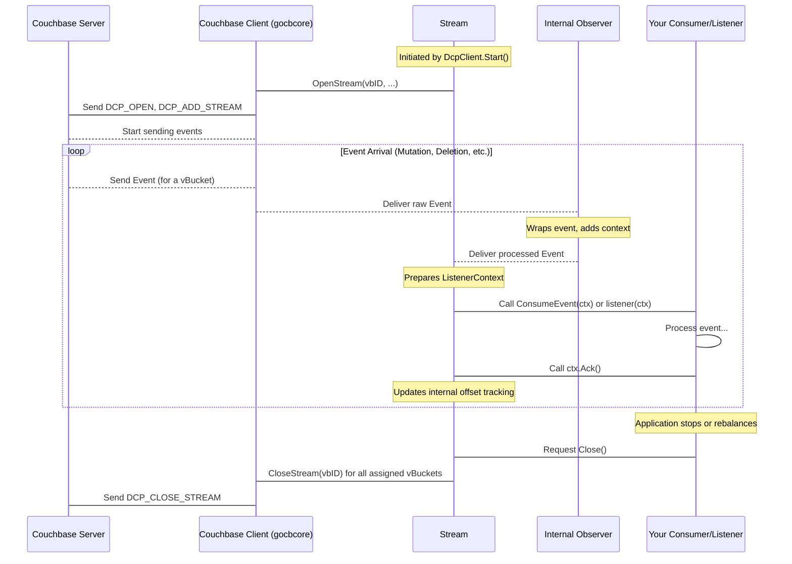

# Chapter 5: Stream

In the [previous chapter](04_couchbase_client__gocbcore_wrapper__.md), we looked at the **Couchbase Client (gocbcore wrapper)**, which is the essential component `go-dcp` uses to talk directly to your Couchbase cluster at a low level, handling the network connections and protocol details.

But getting raw data off the wire is only part of the job. That data stream needs to be actively managed, directed, and processed before it reaches *your* code (the [Consumer / Listener](03_consumer___listener_.md)). This is the role of the **Stream** component.

Think back to our ship analogy. If the [Couchbase Client](04_couchbase_client__gocbcore_wrapper__.md) is the engine and radio getting the ship (data) to the port (Couchbase cluster) and starting the unloading, the **Stream** is the **deck crew responsible for managing the unloading process**. It handles the cranes (opening/closing connections), directs the cargo (events) as it comes off, keeps track of what's been unloaded, and sends it to the right place inside the port (your [Consumer / Listener](03_consumer___listener_.md) for processing).

Its main job is to manage the **active connection and flow of events** from the Couchbase DCP feed for the specific portions of your data (vBuckets) that this `go-dcp` client instance is responsible for.

## Why Do We Need a Stream Component?

Couchbase data is partitioned into vBuckets. When a `go-dcp` client connects, it doesn't just get *one* giant firehose of data for the whole bucket. Instead, it opens separate DCP streams for the specific vBuckets it has been assigned (based on [Membership / VBucket Discovery](09_membership___vbucket_discovery_.md)).

Managing these individual streams requires dedicated logic:

*   **Opening:** Telling Couchbase to start sending events for a particular vBucket from a specific point in time ([Checkpoint](06_checkpoint_.md)).
*   **Receiving:** Handling events arriving from the [Couchbase Client](04_couchbase_client__gocbcore_wrapper__.md) for each active vBucket stream.
*   **Processing Prep:** Preparing the incoming events (adding context like the associated offset) before sending them to your [Consumer / Listener](03_consumer___listener_.md).
*   **Acknowledgement:** Receiving confirmations from your [Consumer / Listener](03_consumer___listener_.md) that an event has been processed and updating the internal tracking necessary for [Checkpointing](06_checkpoint_.md).
*   **Closing:** Gracefully shutting down streams when the client stops or when vBuckets are reassigned (during rebalancing).
*   **Handling Stream-Specific Issues:** Dealing with potential errors specific to a single stream (like Couchbase telling the client to restart the stream or handle a rollback).

The **Stream** component encapsulates all this logic, making the [Dcp Client](01_dcp_client_.md) cleaner and easier to manage.

## Key Responsibilities of the Stream Component

Based on its description and the code structure (`stream/stream.go`), the `Stream` component handles:

*   **VBucket Assignment:** Knowing which vBuckets this client instance is responsible for streaming. (It gets this information from [Membership / VBucket Discovery](09_membership___vbucket_discovery_.md)).
*   **Opening Streams:** Initiating the DCP stream for each assigned vBucket using the [Couchbase Client](04_couchbase_client__gocbcore_wrapper__.md) and the correct starting sequence number from [Checkpoint](06_checkpoint_.md).
*   **Receiving Events:** Acting as the destination for events delivered by the [Couchbase Client](04_couchbase_client__gocbcore_wrapper__.md) for its vBuckets.
*   **Event Flow to Consumer:** Passing processed and contextualized events to the user-provided [Consumer / Listener](03_consumer___listener_.md).
*   **Acknowledgement Handling:** Receiving `ctx.Ack()` calls from the [Consumer / Listener](03_consumer___listener_.md) and updating internal state related to event processing progress for each vBucket.
*   **Closing Streams:** Shutting down the active DCP connections for its vBuckets.
*   **Rebalancing Coordination:** Handling the process of stopping streams for vBuckets that are no longer assigned and starting streams for newly assigned vBuckets.
*   **Rollback Mitigation Coordination:** Interacting with the [Rollback Mitigation](07_rollback_mitigation_.md) component to handle potential data inconsistencies after cluster changes.

## How the Stream Works in the Event Flow

Let's visualize how the `Stream` component fits into the event processing pipeline, building on the diagram from Chapter 1 and 4:



As you can see, the `Stream` is the critical intermediary. It tells the [Couchbase Client](04_couchbase_client__gocbcore_wrapper__.md) which streams to open. When events arrive *from* the [Couchbase Client](04_couchbase_client__gocbcore_wrapper__.md) (via an internal `Observer`), the `Stream` receives them, prepares the `models.ListenerContext` that your [Consumer / Listener](03_consumer___listener_.md) expects, calls your code, and then processes your acknowledgement (`ctx.Ack()`) to update its internal tracking (which the [Checkpoint](06_checkpoint_.md) component will later use).

## Interacting with the Stream (Indirectly)

Like the [Couchbase Client](04_couchbase_client__gocbcore_wrapper__.md), you typically **do not directly interact** with the `Stream` component in your application code. The [Dcp Client](01_dcp_client_.md) creates and manages the `Stream` internally based on your [Configuration](02_configuration_.md) and the assigned vBuckets.

When you call `connector.Start()` on the [Dcp Client](01_dcp_client_.md), the `Dcp Client` initializes the `Stream` and tells it to `Open()`. When your application receives a signal to shut down or `connector.Close()` is called, the `Dcp Client` tells the `Stream` to `Close()`. During rebalancing, the `Dcp Client` tells the `Stream` to `Rebalance()`.

The `Stream` then uses the [Couchbase Client](04_couchbase_client__gocbcore_wrapper__.md), [Checkpoint](06_checkpoint_.md), [Membership / VBucket Discovery](09_membership___vbucket_discovery_.md), and [Rollback Mitigation](07_rollback_mitigation_.md) components to perform its duties.

## Peeking at the Stream's Code (`stream/stream.go`)

Let's look at a few simplified parts of the `stream/stream.go` code to see how it implements its responsibilities.

The `NewStream` function shows the key dependencies the `Stream` needs:

```go
// stream/stream.go (simplified NewStream signature)
func NewStream(
	client couchbase.Client, // Needs the Couchbase Client to talk to CB
	metadata metadata.Metadata, // Needs Metadata to interact with Checkpointing
	config *config.Dcp, // Needs Configuration
	version *couchbase.Version, // Couchbase server version
	bucketInfo *couchbase.BucketInfo, // Bucket details
	vBucketDiscovery VBucketDiscovery, // Needs VBucketDiscovery for assignments
	consumer models.Consumer, // Needs the user's Consumer/Listener
	collectionIDs map[uint32]string, // Collection mappings
	stopCh chan struct{}, // Channel for stopping
	eventHandler models.EventHandler, // Hooks for lifecycle events
	tc *tracing.TracerComponent, // Tracing
) Stream {
	// ... initialization ...
}
```

The `Open()` method orchestrates the start-up sequence:

```go
// stream/stream.go (simplified Open method)
func (s *stream) Open() {
	// ... setup ...
	vbIDs := s.vBucketDiscovery.Get() // Get assigned vBuckets
	// ... init rollback mitigation if enabled ...
	// ... init checkpointing ...
	s.offsets, s.dirtyOffsets, s.anyDirtyOffset = s.checkpoint.Load() // Load start offsets
	// ... init internal observers for each vbucket ...
	s.openAllStreams(vbIDs) // Tell Couchbase Client to open streams
	// ... start checkpointing schedule ...
	// ... wait for streams to finish or be closed ...
}
```

The `openAllStreams` function iterates through the assigned vBuckets and calls `openStream` for each:

```go
// stream/stream.go (simplified openStream method)
func (s *stream) openStream(vbID uint16) error {
	offset, exist := s.offsets.Load(vbID) // Get start offset for this vbucket
	if !exist {
		// Handle error - shouldn't happen if Checkpoint.Load works
	}
	observer, _ := s.observers.Load(vbID) // Get the internal observer
	// Tell the Couchbase Client to open the stream, passing the observer
	return s.client.OpenStream(vbID, s.collectionIDs, offset, observer)
}
```

Notice that `s.client.OpenStream` is passed the `observer`. Events received by the [Couchbase Client](04_couchbase_client__gocbcore_wrapper__.md) for that stream will be delivered to this observer.

The internal `observer` (defined in `couchbase/observer.go`, but used *by* the `Stream`) calls the `Stream`'s `listen` method when it receives an event:

```go
// stream/stream.go (simplified listen method)
func (s *stream) listen(args models.ListenerArgs) {
	// args contains the raw event and tracing context from the observer
	switch v := args.Event.(type) {
	case models.DcpMutation:
		s.waitAndForward(v, args.TraceContext, v.Offset, v.VbID, v.EventTime) // Prepare and forward
	case models.DcpDeletion:
		s.waitAndForward(v, args.TraceContext, v.Offset, v.VbID, v.EventTime) // Prepare and forward
	// ... other event types ...
	}
}
```

The `waitAndForward` function is where the `ListenerContext` is created and your [Consumer / Listener](03_consumer___listener_.md) is called:

```go
// stream/stream.go (simplified waitAndForward method)
func (s *stream) waitAndForward(
	payload interface{}, // The raw event
	spanCtx tracing.RequestSpanContext,
	offset *models.Offset,
	vbID uint16,
	eventTime time.Time,
) {
	// ... handle metadata events ...

	ctx := &models.ListenerContext{
		Commit: s.checkpoint.Save, // Provide the checkpoint save function
		Event:  payload, // The event itself
		Ack: func() { // Define the Ack() function for the user
			s.setOffset(vbID, offset, true) // Call setOffset when user acks
			s.anyDirtyOffset = true
		},
		ListenerTracerComponent: s.tracerComponent.NewListenerTracerComponent(spanCtx),
	}

	// Call the user's consumer/listener
	s.consumer.ConsumeEvent(ctx) // Or the listener function if not a Consumer
}
```

Finally, the `setOffset` function is called when your `ctx.Ack()` is executed. This method updates the `Stream`'s internal map of processed sequence numbers for the vBucket and marks the offset as "dirty", indicating it needs to be checkpointed eventually.

```go
// stream/stream.go (simplified setOffset method)
func (s *stream) setOffset(vbID uint16, offset *models.Offset, dirty bool) {
	// ... check if vbucket is assigned to this instance ...
	s.offsets.Store(vbID, offset) // Store the new offset
	s.consumer.TrackOffset(vbID, offset) // Call the consumer's TrackOffset (if implemented)
	if dirty {
		s.dirtyOffsets.StoreIf(vbID, func(p bool, f bool) (v bool, s bool) {
            // Mark as dirty if it wasn't already
        })
	}
}
```

This flow shows how the `Stream` coordinates event reception, preparation, user notification, and acknowledgement processing, all while interacting with other key components.

## Stream Lifecycle

The `Stream` goes through a lifecycle, primarily driven by the [Dcp Client](01_dcp_client_.md):

1.  **Initialization:** Created by the [Dcp Client](01_dcp_client_.md) when `NewDcp` is called.
2.  **Opening:** The [Dcp Client](01_dcp_client_.md) calls `Stream.Open()`. The stream gets vBucket assignments, loads checkpoints, and opens DCP streams via the [Couchbase Client](04_couchbase_client__gocbcore_wrapper__.md). It then waits for events or a stop signal.
3.  **Streaming:** Receives events, passes them to the [Consumer / Listener](03_consumer___listener_.md), processes acknowledgements. Interacts with [Checkpoint](06_checkpoint_.md), [Rollback Mitigation](07_rollback_mitigation_.md).
4.  **Rebalancing:** The [Dcp Client](01_dcp_client_.md) calls `Stream.Rebalance()`. The stream initiates a shutdown, then re-opens based on new vBucket assignments.
5.  **Closing:** The [Dcp Client](01_dcp_client_.md) calls `Stream.Close()`. The stream stops internal processes (like checkpointing schedule) and closes all active DCP streams via the [Couchbase Client](04_couchbase_client__gocbcore_wrapper__.md).

## Conclusion

The **Stream** component is the active manager of the DCP connection and event flow for the vBuckets assigned to a `go-dcp` client instance. It sits between the low-level communication handled by the [Couchbase Client](04_couchbase_client__gocbcore_wrapper__.md) and your event processing logic in the [Consumer / Listener](03_consumer___listener_.md). It handles opening and closing streams, delivering events to your code, processing acknowledgements for [Checkpointing](06_checkpoint_.md), and coordinating with features like rebalancing and rollback mitigation.

While you don't interact with it directly, understanding the `Stream`'s role helps clarify how `go-dcp` manages the complex, real-time flow of data changes from Couchbase.

Now that we know how events are streamed and delivered, the next logical step is to understand how `go-dcp` keeps track of your progress so it can resume correctly if needed.

Let's move on to the next chapter: [Checkpoint](06_checkpoint_.md).

