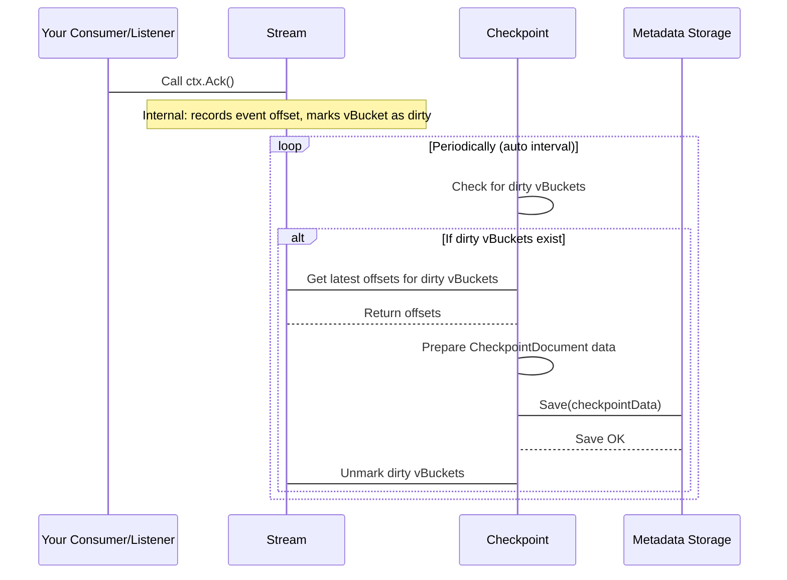
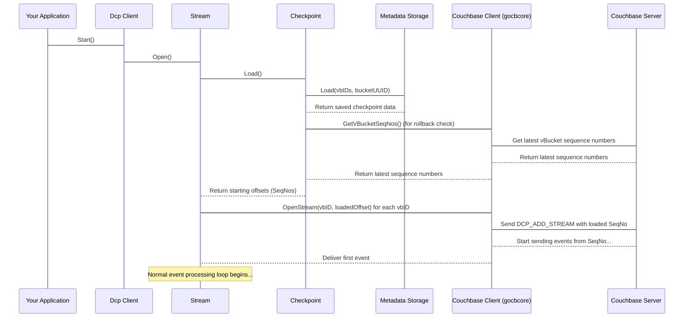

# Chapter 6: Checkpoint

In the [previous chapter](05_stream_.md), we learned how the **Stream** component actively manages the connection and flow of change events from Couchbase for the vBuckets assigned to your `go-dcp` client. It receives events from the [Couchbase Client](04_couchbase_client__gocbcore_wrapper__.md), prepares them, sends them to *your* [Consumer / Listener](03_consumer___listener_.md), and processes your crucial `ctx.Ack()` call.

But what happens if your application crashes, loses network connectivity, or needs to be stopped and restarted for maintenance? When you start `go-dcp` again, how does it know *where* to resume receiving events from?

If it started from the very beginning of time (sequence number 0) for all vBuckets, it would re-process potentially millions or billions of historical events, which is usually inefficient and wrong. If it just tried to pick a recent point, it might miss events that occurred while it was offline.

This is the problem the **Checkpoint** component solves.

Think of checkpointing like saving your progress in a video game. When you save, the game records your exact state (your location, inventory, score, etc.) so that if you stop playing and come back later, you can load that save and resume exactly where you left off.

In `go-dcp`, **Checkpointing is the mechanism for saving the progress of the DCP stream.** It records the last sequence number for each vBucket that your application has successfully processed (by calling `ctx.Ack()`). When your `go-dcp` client starts, it loads this saved checkpoint and tells Couchbase to start streaming from those specific sequence numbers for each vBucket.

The core purpose of checkpointing is to enable **reliable resumption** of the DCP stream.

## What Information Does a Checkpoint Store?

For each vBucket assigned to your `go-dcp` instance, a checkpoint needs to store the essential information required to reopen the stream correctly:

*   **VBucket ID:** Which partition of data this checkpoint is for.
*   **Last Processed Sequence Number (`SeqNo`):** The sequence number of the last event for this vBucket that your [Consumer / Listener](03_consumer___listener_.md) acknowledged via `ctx.Ack()`. This is the primary point of resumption.
*   **VBucket UUID (`VbUUID`):** A unique identifier for the vBucket's history on the Couchbase server. This is important for [Rollback Mitigation](07_rollback_mitigation_.md).
*   **Snapshot Markers (`StartSeqNo`, `EndSeqNo`):** DCP events often come in groups called snapshots. These markers help define the range of sequence numbers within the current snapshot being processed.

This collection of data for all assigned vBuckets makes up the checkpoint state.

## Where Are Checkpoints Stored?

For checkpointing to be useful after a restart, the progress must be saved to a **persistent storage** location that survives your application stopping. `go-dcp` offers flexibility here, configurable via the [Configuration](02_configuration_.md):

1.  **Couchbase (Recommended):** Checkpoint data is stored as documents (specifically, within Extended Attributes or Xattrs) in a designated scope and collection within the *same* Couchbase cluster you are streaming from. This is often the most convenient and recommended method, especially if you are running multiple `go-dcp` instances for high availability or throughput (covered in [Membership / VBucket Discovery](09_membership___vbucket_discovery_.md)).
2.  **File System:** Checkpoint data is saved to a local file on the machine running your `go-dcp` application. This is simpler for single-instance deployments but doesn't work for distributed setups and requires ensuring the file location is persistent.

You specify the storage type and details in your `config.yml` or `config.Dcp` struct (see [Chapter 2: Configuration](02_configuration_.md)).

Example `config.yml` snippet for Couchbase metadata:

```yaml
# ... other config ...
checkpoint:
  type: auto         # Automatic saving
  interval: 1m       # Save every 1 minute
  metadata: couchbase # Store checkpoint in Couchbase
    bucketName: dcp-test-metadata # Can be the same bucket or different
    scope: _default # Use default scope
    collection: _default # Use default collection
  # timeout: 10s # Optional: Timeout for saving/loading
```

Example `config.yml` snippet for File metadata:

```yaml
# ... other config ...
checkpoint:
  type: auto         # Automatic saving
  interval: 1m       # Save every 1 minute
  metadata: file     # Store checkpoint in a file
    path: /tmp/my_dcp_checkpoint.json # Path to the checkpoint file
  # timeout: 10s # Optional: Timeout for saving/loading
```

## How Checkpointing Works: Saving Progress

The core interaction that drives checkpointing from *your* perspective is calling `ctx.Ack()` in your [Consumer / Listener](03_consumer___listener_.md).

As discussed in [Chapter 3: Consumer / Listener](03_consumer___listener_.md), `ctx.Ack()` tells `go-dcp` that you have successfully processed the event associated with that context.

When you call `ctx.Ack()`, `go-dcp` doesn't immediately save the checkpoint to persistent storage. That would be very inefficient (saving for every single event!). Instead, calling `ctx.Ack()` does two important things internally:

1.  It marks the event's sequence number as "processed" for that specific vBucket.
2.  It marks the internal state for that vBucket as "dirty" – indicating that its progress has changed and eventually needs to be saved.

The actual *saving* of the checkpoint happens based on your configuration's `checkpoint.type`:

*   **`auto` (Automatic):** If `checkpoint.type` is set to `auto`, `go-dcp` automatically starts a background process when the client starts. This process periodically checks for vBuckets marked as "dirty" and, according to the `checkpoint.interval`, gathers the latest processed sequence numbers for those dirty vBuckets and saves them to your configured persistent storage (Couchbase or file). This is the most common and recommended mode for beginners.
*   **`manual` (Manual):** If `checkpoint.type` is set to `manual`, `go-dcp` does *not* save checkpoints automatically. It's *your* responsibility to trigger the save. You do this by calling `ctx.Commit()` from within your [Consumer / Listener](03_consumer___listener_.md). When you call `ctx.Commit()`, `go-dcp` will immediately gather all vBuckets currently marked as "dirty" and save their latest acknowledged offsets to storage. You might use this if you need fine-grained control over when saves happen, perhaps batching commits after processing a certain number of events or after completing a specific transaction in your application.

For beginners, `auto` checkpointing is simpler as it handles the saving schedule for you.

Here's a simplified view of the saving process in `auto` mode:



When you call `ctx.Ack()`, the `Stream` component updates its internal tracking of the latest acknowledged sequence number for that vBucket and flags it as needing a checkpoint save. The `Checkpoint` component, running on a schedule in `auto` mode, reads these dirty flags, fetches the latest offsets from the `Stream`, formats the data, and calls the `Save` method of the specific `Metadata` implementation (Couchbase or File) to persist it.

If using `manual` mode, your call to `ctx.Commit()` would directly trigger the `Checkpoint->Stream->Checkpoint->Metadata.Save()` sequence instead of the periodic loop.

## How Checkpointing Works: Loading Progress

Loading the checkpoint is simpler from a user's perspective. It happens automatically when you call `connector.Start()` on the [Dcp Client](01_dcp_client_.md).

Before `go-dcp` opens any DCP streams from Couchbase, the [Dcp Client](01_dcp_client_.md) orchestrates the loading process:

1.  It identifies which vBuckets this client instance is responsible for (via [Membership / VBucket Discovery](09_membership___vbucket_discovery_.md)).
2.  It tells the `Checkpoint` component to `Load()` the checkpoint state for these vBuckets from the configured persistent storage.
3.  The `Checkpoint` component calls the `Load` method of the configured `Metadata` implementation (Couchbase or File).
4.  The `Metadata` implementation reads the saved state.
5.  The `Checkpoint` component processes the loaded data. It performs some checks (e.g., comparing loaded sequence numbers against the latest sequence numbers on the server to detect [Rollback Mitigation](07_rollback_mitigation_.md) scenarios, more on this in the next chapter).
6.  The `Checkpoint` component returns the starting sequence numbers for each vBucket to the `Stream` component.
7.  The `Stream` component uses these loaded sequence numbers when it calls the [Couchbase Client](04_couchbase_client__gocbcore_wrapper__.md) to `OpenStream()` for each vBucket.

Simplified view of loading:



This automated loading process ensures that your `go-dcp` client resumes streaming precisely from where it left off, preventing data loss or excessive re-processing.

## Diving a Bit Deeper: The Metadata Implementations

The actual saving and loading logic depends on the `metadata` implementation you choose. The `metadata` package defines the `Metadata` interface:

```go
// metadata/metadata.go
type Metadata interface {
	// Save persists the checkpoint state for the given vBuckets.
	Save(state map[uint16]*models.CheckpointDocument, dirtyOffsets map[uint16]bool, bucketUUID string) error
	// Load retrieves the checkpoint state for the given vBuckets.
	Load(vbIds []uint16, bucketUUID string) (*wrapper.ConcurrentSwissMap[uint16, *models.CheckpointDocument], bool, error)
	// Clear removes the checkpoint state for the given vBuckets.
	Clear(vbIds []uint16) error
}
```

`go-dcp` provides implementations for this interface:

*   **`cbMetadata` (`couchbase/metadata.go`):** Implements `Save` and `Load` by performing Key-Value operations (specifically, using Xattrs) against the Couchbase cluster via the [Couchbase Client](04_couchbase_client__gocbcore_wrapper__.md). It stores each vBucket's checkpoint as a separate document with a key like `_connector:cbgo:<groupName>:checkpoint:<vbID>`.
    *   The `Save` method iterates over the `dirtyOffsets` map provided by the `Stream` and saves a checkpoint document for each dirty vBucket using `UpsertXattrs`. It uses the [Couchbase Client](04_couchbase_client__gocbcore_wrapper__.md)'s `GetMetaAgent()` for this.
    *   The `Load` method fetches checkpoint documents for all assigned `vbIds` using `GetXattrs`. It also uses the [Couchbase Client](04_couchbase_client__gocbcore_wrapper__.md) internally.
*   **`fileMetadata` (`metadata/file_metadata.go`):** Implements `Save` and `Load` by reading from and writing to a JSON file on the local disk.
    *   The `Save` method marshals the entire checkpoint state map into JSON and writes it to the configured file path.
    *   The `Load` method reads the JSON file, unmarshals it into the state map. If the file doesn't exist, it initializes an empty state.

The `Checkpoint` component (`stream/checkpoint.go`) depends on the `Metadata` interface, so it doesn't need to know *how* the saving/loading happens, only that it can call `Save()` and `Load()` on whatever `Metadata` implementation was configured.

## Checkpoint and Other Components

The `Checkpoint` component works closely with others:

*   **[Stream](05_stream_.md):** The stream component is the primary consumer and source of checkpoint data. It loads offsets from the checkpoint on startup and provides updated offsets to the checkpoint component when `ctx.Ack()` is processed.
*   **[Configuration](02_configuration_.md):** Configuration dictates the checkpoint type (`auto`/`manual`), the saving interval (`auto` mode), the metadata storage type (Couchbase/File), and storage details.
*   **[Couchbase Client](04_couchbase_client__gocbcore_wrapper__.md):** Used by the Checkpoint component (during `Load`) to get the *latest* sequence numbers on the server for [Rollback Mitigation](07_rollback_mitigation_.md) checks. It's also used by the `cbMetadata` implementation for actual storage interactions.
*   **[Consumer / Listener](03_consumer___listener_.md):** Your code in the listener/consumer drives checkpointing by calling `ctx.Ack()`. In `manual` mode, you also trigger saves via `ctx.Commit()`.
*   **[Rollback Mitigation](07_rollback_mitigation_.md):** Checkpoint loading is where rollback checks happen. The loaded checkpoint's `VbUUID` and `SeqNo` are compared against the current server state fetched via the [Couchbase Client](04_couchbase_client__gocbcore_wrapper__.md). If a mismatch indicates a rollback, the [Rollback Mitigation](07_rollback_mitigation_.md) logic is triggered.

## Conclusion

Checkpointing is a fundamental concept for building reliable DCP consumers. It ensures that your `go-dcp` application can stop and restart without losing or unnecessarily re-processing change events. By understanding that `ctx.Ack()` marks your progress and that `go-dcp` periodically (or manually) saves this progress to persistent storage (Couchbase or file), you can build robust applications that handle interruptions gracefully.

The checkpoint loading process automatically happens when `go-dcp` starts, ensuring streams are opened from the correct point.

However, sometimes the Couchbase cluster itself might experience a "rollback" (e.g., due to a failure and failover). If the saved checkpoint points to a sequence number *before* the rollback point, `go-dcp` needs a way to handle this inconsistency. This is the topic of our next chapter.

[Chapter 7: Rollback Mitigation](07_rollback_mitigation_.md)

