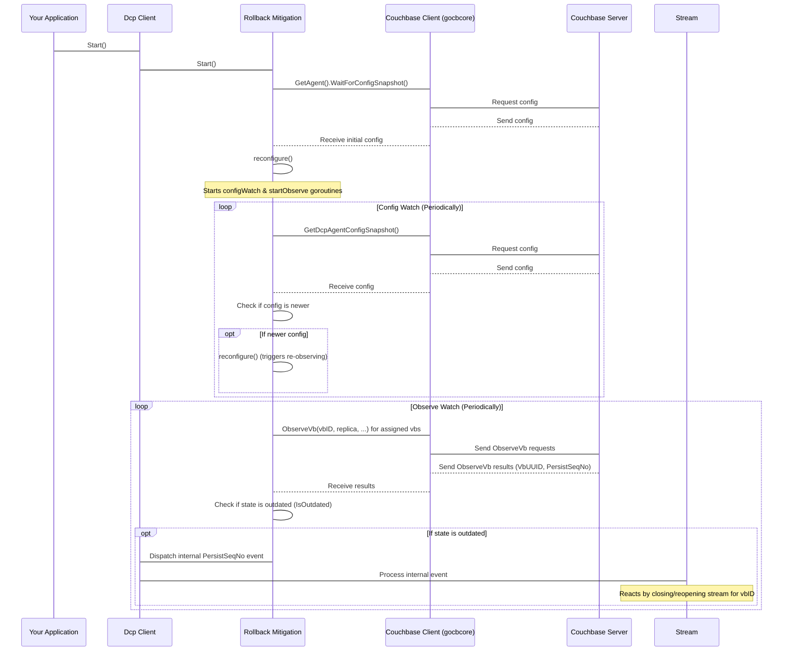

# Chapter 7: Rollback Mitigation

In the [previous chapter](06_checkpoint_.md), we learned how the **Checkpoint** component helps your `go-dcp` client remember its progress by saving the last processed sequence numbers for each vBucket. This allows the client to resume streaming accurately after stopping and restarting, preventing missed events or unnecessary reprocessing.

However, there's a scenario in Couchbase clusters that can challenge even the best checkpointing: a **vBucket rollback**.

Think about what happens during a Couchbase server failure and failover. If the node that was the active host for a vBucket fails, one of its replicas is promoted to become the new active. In some cases, due to replication delays or other factors, the replica might not have received *all* the very latest changes that were on the old active node just before it failed. When this replica becomes active, its history for that vBucket effectively becomes the new "truth", even though it might be slightly behind the point the old active reached. This is known as a **rollback** – the vBucket's history has been rewritten to an earlier state on the new active node.

If your `go-dcp` client had checkpointed a sequence number *after* this rollback point just before the failover, simply resuming from that saved sequence number would be wrong. You'd be asking the new active node for events starting from a point that no longer exists in its history! This would lead to errors and potentially missed data.

The **Rollback Mitigation** component is designed specifically to handle this complex situation.

Its purpose is to:

1.  **Detect** when a vBucket rollback has occurred on the Couchbase server.
2.  **Identify** the point where the stream should *actually* restart.
3.  **Help the client recover** by instructing the streaming mechanism ([Stream](05_stream_.md)) to reopen the stream from the correct, new starting point.

This ensures that even after cluster topology changes and rollbacks, your `go-dcp` client can reliably continue processing the change stream without getting stuck or missing data.

## How Rollback Mitigation Works (High-Level)

The core idea behind rollback detection involves monitoring the state of vBuckets on the Couchbase server and comparing it to the state your client expects.

Here are the key steps this component takes:

1.  **Monitor Cluster Configuration:** It watches for changes in the Couchbase cluster topology (which nodes host which vBuckets). This is the first hint that a failover or rebalance might have happened.
2.  **Observe VBucket State:** For the vBuckets currently assigned to this `go-dcp` client, it periodically uses low-level Couchbase commands (`ObserveVb`) to ask the cluster about the state of the vBucket's replicas. Specifically, it's interested in the **VBucket UUID (VbUUID)** and the **Persisted Sequence Number** for each replica.
    *   **VbUUID:** This is like a unique version identifier for a vBucket's history on a specific node. If the VbUUID for a vBucket changes on the active replica, it means a different history (likely from a failed replica) has taken over – a strong indicator of a rollback.
    *   **Persisted Sequence Number:** This is the sequence number up to which data has been written to disk for that replica. Monitoring this on replicas helps understand the cluster's view of data durability.
3.  **Compare and Detect:** It compares the observed VbUUID and persisted sequence numbers with the known state (derived from the loaded checkpoint and previous observations). If a significant discrepancy is found (like a changed VbUUID on the active replica or an unexpectedly lower persisted sequence number), it flags the vBucket as potentially having rolled back.
4.  **Notify:** When a potential rollback is detected for a vBucket, the Rollback Mitigation component notifies other parts of `go-dcp` (specifically the [Stream](05_stream_.md) manager) about the issue.
5.  **Recover:** The [Stream](05_stream_.md) component, upon being notified, will typically close the current stream for that vBucket and open a *new* stream starting from sequence number 0 or the earliest available sequence number in the new history. This ensures it starts consuming from a valid point on the new active replica, even if it means reprocessing some events that occurred *before* the rollback point.

The process is mostly automatic and runs in the background once configured.

## Using Rollback Mitigation

From a user's perspective, enabling rollback mitigation is primarily done through the **Configuration** ([Chapter 2: Configuration](02_configuration_.md)).

You enable it and configure its behavior within the `rollbackMitigation` section of your `config.yml`:

```yaml
# config.yml snippet
# ... other config ...

dcp:
  # ... other dcp settings ...
  rollbackMitigation:
    enabled: true
    interval: 5s         # How often to observe vbucket state (e.g., every 5 seconds)
    configWatchInterval: 30s # How often to check for cluster config changes (e.g., every 30 seconds)

# ... rest of config ...
```

*   `enabled: true`: This is the most important setting. Set this to `true` to turn on rollback mitigation.
*   `interval`: This controls how frequently the component will check the persisted sequence numbers and VbUUIDs for your assigned vBuckets. A lower interval means quicker detection but slightly more load on the cluster. 5-10 seconds is often a reasonable starting point.
*   `configWatchInterval`: This controls how frequently the component polls for cluster configuration updates. Cluster configuration changes are a primary trigger for checking for potential rollbacks.

Once enabled in the configuration, the `go-dcp` client automatically starts the rollback mitigation process when you call `connector.Start()`. You don't need to add special code to your [Consumer / Listener](03_consumer___listener_.md) specifically for rollback handling (other than ensuring your processing logic can handle receiving events from the very beginning if a rollback is detected).

## Internal Details: Peeking Under the Hood

The core logic for rollback mitigation lives in the `couchbase/rollback_mitigation.go` file.

When `go-dcp` starts and rollback mitigation is enabled, a `RollbackMitigation` instance is created (`NewRollbackMitigation`) and its `Start()` method is called.

The `Start()` method does a few things:

1.  **Wait for First Config:** It waits to receive the initial cluster configuration snapshot using the [Couchbase Client](04_couchbase_client__gocbcore_wrapper__.md).
2.  **Reconfigure:** It calls an internal `reconfigure()` method.
3.  **Start Watchers:** It starts two background goroutines: one for `configWatch()` and one for `startObserve()`.

Let's look at the simplified internal flow:



**`configWatch()`:** This goroutine periodically checks for new cluster configurations. If a new configuration is detected, it triggers `reconfigure()`. A new configuration often means a failover or rebalance has completed, making it a prime time to re-evaluate the state of the vBuckets.

**`startObserve()`:** This goroutine runs on the configured `interval`. For each vBucket assigned to the client, it iterates through its replicas and uses `client.GetAgent().ObserveVb()` (via the `observeVbID` helper) to fetch the current `VbUUID` and `PersistSeqNo` from the server.

When `ObserveVb` results come back, the `observe()` method processes them:

```go
// Simplified logic inside observe()
func (r *rollbackMitigation) observe(vbID uint16, replica int, groupID int, vbUUID gocbcore.VbUUID, wg *sync.WaitGroup) {
    // ... (waits for ObserveVb result) ...

    if replicas[replica].IsOutdated(result) {
        // Detected a mismatch between our known state and the server state!
        logger.Log.Info("Detected outdated state for vbID %v, replica %v", vbID, replica)

        // Update internal state with the new values
        replicas[replica].SetSeqNo(result.PersistSeqNo)
        replicas[replica].SetVbUUID(result.VbUUID)

        // Check the *minimum* persisted seqNo across all observed replicas
        minSeqNo := r.getMinSeqNo(vbID) // This logic is complex, finds lowest *valid* seqNo

        // Dispatch an internal event to signal potential rollback/change
        r.persistSeqNoDispatcher(&models.PersistSeqNo{
            VbID:  vbID,
            SeqNo: minSeqNo, // Or potentially 0 depending on logic
        })
    }

    if vbUUID != result.VbUUID {
        // VbUUID changed on this replica, update our map
        r.vbUUIDMap.Store(vbID, result.VbUUID)
    }
}
```

The `IsOutdated()` check compares the last known `VbUUID` and `PersistSeqNo` for that specific replica against the values just received from the server. If they don't match, it's a potential issue.

When `IsOutdated()` is true, or a config change occurs, the component dispatches a `models.PersistSeqNo` event using the `persistSeqNoDispatcher` function (which is passed into the `RollbackMitigation` component when it's created). This is how the Rollback Mitigation component signals to the `Stream` component that something has changed for a specific vBucket (`VbID`) and provides a `SeqNo` (often the minimum observed, or a trigger to restart from 0) that the stream *might* need to consider.

The `Stream` component (specifically its internal `observer`) is subscribed to receive these `models.PersistSeqNo` events. When the `Stream` receives such an event for a vBucket it's managing, it interprets it as a potential history change. Its reaction is to shut down the current DCP stream for that vBucket and open a new one, typically starting from sequence number 0, ensuring it captures all events from the beginning of the *new* vBucket history on the active node.

This low-level observation and event dispatching mechanism is the core of how `go-dcp` detects potential rollbacks and allows the `Stream` to react accordingly.

## Rollback Mitigation and Other Components

*   **[Configuration](02_configuration_.md):** Provides the `enabled`, `interval`, and `configWatchInterval` settings.
*   **[Couchbase Client (gocbcore wrapper)](04_couchbase_client__gocbcore_wrapper__.md):** The Rollback Mitigation component relies heavily on the `Couchbase Client` to perform `ObserveVb` operations and fetch cluster configuration snapshots.
*   **[Stream](05_stream_.md):** The `Stream` component is the recipient of the internal events dispatched by Rollback Mitigation. It's responsible for reacting to these events by closing and reopening affected DCP streams.
*   **[Checkpoint](06_checkpoint_.md):** While Rollback Mitigation primarily observes the *server's* state, the *loading* of the checkpoint (handled by the Checkpoint component on startup) also includes getting the vBucket's `VbUUID`. Rollback Mitigation compares this loaded `VbUUID` to the observed `VbUUID` on the server as part of its detection logic.
*   **[Observer](08_observer_.md):** (Upcoming chapter) The internal mechanism for dispatching and receiving events like `models.PersistSeqNo` between components relies on an observer/dispatcher pattern. The `Stream` acts as an observer for events dispatched by Rollback Mitigation.

## Conclusion

VBucket rollbacks are a reality in distributed databases like Couchbase during failover scenarios. Without proper handling, they can lead to data inconsistencies or processing errors in DCP clients. The **Rollback Mitigation** component in `go-dcp` provides an automatic mechanism to detect these rollbacks by monitoring the cluster's configuration and vBucket state (VbUUIDs and persisted sequence numbers).

When a potential rollback is identified, it signals the [Stream](05_stream_.md) manager to react, typically by restarting the stream for the affected vBucket from a safe point (often sequence number 0). By simply enabling this feature in your [Configuration](02_configuration_.md), you add a crucial layer of resilience to your `go-dcp` application, ensuring reliable data processing even through challenging cluster events.

Now that we've explored how `go-dcp` detects and recovers from rollbacks, let's delve into another core mechanism that facilitates communication and state changes *between* different components in the library: the **Observer**.

[Chapter 8: Observer](08_observer_.md)

---

<sub><sup>Generated by [AI Codebase Knowledge Builder](https://github.com/The-Pocket/Tutorial-Codebase-Knowledge).</sup></sub> <sub><sup>**References**: [[1]](https://github.com/Trendyol/go-dcp/blob/f83516164dfbcc3050230193a865f051a4097d0e/couchbase/rollback_mitigation.go)</sup></sub>