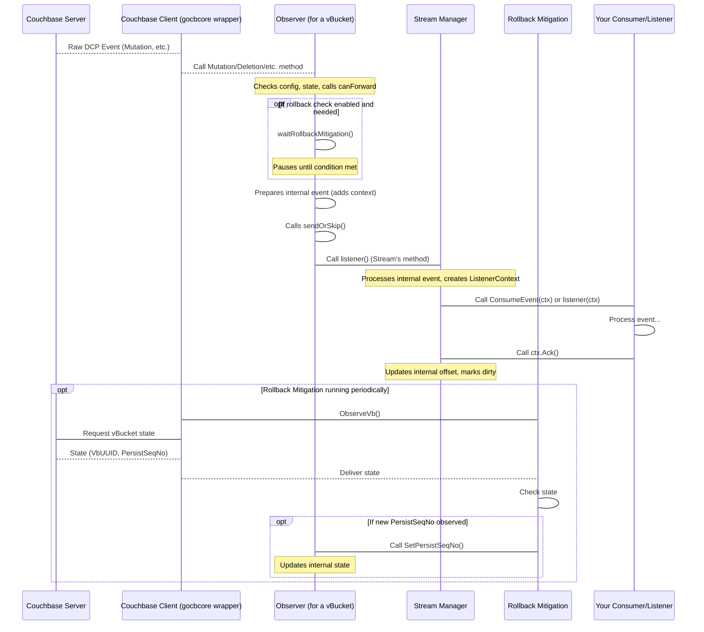

# Chapter 8: Observer

In the [previous chapter](07_rollback_mitigation_.md), we discussed how `go-dcp` handles **Rollback Mitigation** to ensure your stream processing remains accurate even after cluster failovers that might cause a vBucket's history to change. This involved detecting changes in vBucket UUIDs and persistent sequence numbers.

Now, let's look at a component that is deeply involved in receiving the raw events from Couchbase for a specific vBucket and plays a role in interacting with the rollback logic: the **Observer**.

Think of the `go-dcp` client as a factory processing raw materials (DCP events).
*   The [Couchbase Client (gocbcore wrapper)](04_couchbase_client__gocbcore_wrapper__.md) is the loading dock where raw events arrive from the Couchbase truck.
*   The [Stream](05_stream_.md) manager is the floor manager, deciding which vBucket's events go to which processing line.
*   Your [Consumer / Listener](03_consumer___listener_.md) is the final assembly station where the finished product (your application logic) is applied.

The **Observer** is like a **specialized quality control and prep station on *each* processing line (vBucket)**. It's the first place raw events go after leaving the loading dock for a particular vBucket.

Its primary job for a single vBucket stream is to:

1.  Receive the *raw* DCP event from the low-level client (`gocbcore`).
2.  Perform initial checks and attach necessary context (like the associated sequence number, vBucket UUID, collection name).
3.  Potentially filter events based on internal logic (like rollback state or skip windows).
4.  Pass the prepared event to the next stage (the [Stream](05_stream_.md) manager) for eventual delivery to your [Consumer / Listener](03_consumer___listener_.md).
5.  Keep track of basic metrics (like event counts) for its specific vBucket.

Essentially, the Observer is a **per-vbucket callback handler** that bridges the gap between the raw events from `gocbcore` and the structured events needed by the `go-dcp` `Stream` and your `Consumer`/`Listener`.

## The Need for a Per-VBucket Observer

Why do we need an Observer *per vBucket*?

Couchbase streams events on a per-vBucket basis. When `go-dcp` opens a DCP stream for a vBucket using `gocbcore`, `gocbcore` needs a callback handler specifically for *that* stream to deliver events. The Observer provides this callback interface.

By having a dedicated Observer for each vBucket stream, `go-dcp` can:

*   Isolate event processing logic to the specific vBucket.
*   Maintain per-vBucket state (like the current snapshot marker, vBucket UUID, or metrics).
*   Coordinate with features like Rollback Mitigation on a vBucket level.

## Using the Observer (Indirectly)

As a user of the `go-dcp` library, **you will not directly create or interact with an Observer**. You also **do not implement the Observer interface**.

The Observer is an **internal component** of the `go-dcp` library, managed by the [Stream](05_stream_.md) component.

When the [Stream](05_stream_.md) component is initialized and determines which vBuckets it needs to stream (based on [Membership / VBucket Discovery](09_membership___vbucket_discovery_.md)), it creates a dedicated `Observer` instance for *each* of those vBuckets. When the `Stream` then calls the [Couchbase Client](04_couchbase_client__gocbcore_wrapper__.md)'s `OpenStream()` method for a vBucket, it passes this newly created Observer as the place where `gocbcore` should send events for that vBucket.

The `go-dcp` client orchestrates this setup automatically based on your [Configuration](02_configuration_.md).

## Peeking Inside: The Observer's Role in the Code

Let's look at the `Observer` interface defined in `couchbase/observer.go`:

```go
// couchbase/observer.go (simplified interface)
type Observer interface {
	// Callbacks for various event types from gocbcore
	SnapshotMarker(marker models.DcpSnapshotMarker)
	Mutation(mutation gocbcore.DcpMutation)
	Deletion(deletion gocbcore.DcpDeletion)
	Expiration(expiration gocbcore.DcpExpiration)
	End(dcpEnd models.DcpStreamEnd, err error)
	// ... other event types (Collection/Scope, etc.) ...

	// Methods for internal state management
	GetMetrics() *ObserverMetric // Get per-vbucket stats
	GetPersistSeqNo() gocbcore.SeqNo // Get observed minimum persisted seqno
	SetPersistSeqNo(gocbcore.SeqNo) // Update observed minimum persisted seqno
	SetCatchup(seqNo gocbcore.SeqNo) // Set catchup sequence number after rollback
	SetVbUUID(vbUUID gocbcore.VbUUID) // Set vBucket UUID

	Close() // Signal the observer is closing
	CloseEnd() // Signal the end callback is finished
}
```

This interface defines the methods that `gocbcore` calls when it receives specific types of events from Couchbase for a stream. For example, when `gocbcore` gets a mutation event from the wire, it calls the `Mutation()` method on the Observer instance associated with that stream.

The actual implementation is the `observer` struct also in `couchbase/observer.go`. This struct holds the per-vbucket state and logic.

```go
// couchbase/observer.go (simplified struct fields)
type observer struct {
	config          *dcp.Dcp
	currentSnapshot *models.SnapshotMarker // Tracks current snapshot range
	collectionIDs   map[uint32]string    // Mapping from Collection ID to Name
	metrics         *ObserverMetric      // Per-vbucket counter
	listener        func(args models.ListenerArgs) // The function in Stream to call next
	endListener     func(context models.DcpStreamEndContext) // Callback for stream end
	vbUUID          gocbcore.VbUUID      // Current VbUUID for this vBucket
	catchupSeqNo    uint64               // Sequence number to catch up to (rollback)
	persistSeqNo    gocbcore.SeqNo       // Minimum observed persisted sequence number
	latestSeqNo     uint64               // Latest seqno seen (not necessarily processed)
	vbID            uint16               // This vBucket's ID
	isCatchupNeed   bool                 // Flag for rollback catchup state
	closed          bool                 // Is the observer closing?
	endClosed       bool                 // Is the end callback done?
}
```

When a raw event arrives, say a `gocbcore.DcpMutation`, the Observer's `Mutation` method is called. Inside this method, the Observer does several things:

1.  It checks if it can forward the event (`so.canForward(event.SeqNo, false)`). This method includes logic to check against the `persistSeqNo` state, potentially waiting if the Rollback Mitigation component indicates the cluster hasn't persisted up to this point yet (`so.waitRollbackMitigation`). This is how the Observer integrates with the rollback detection.
2.  It checks if the event is before any configured `SkipUntil` time.
3.  It checks if the event's sequence number is within the currently known snapshot markers (`so.IsInSnapshotMarker(event.SeqNo)`).
4.  It **wraps** the raw `gocbcore` event into an internal `models.InternalDcpMutation` (or similar type), attaching important context like the current `Offset` (`SnapshotMarker`, `VbUUID`, `SeqNo`, `LatestSeqNo`) and resolving the `CollectionID` to its name.
5.  It calls the `so.sendOrSkip()` method, passing this prepared internal event.
6.  Inside `so.sendOrSkip()`, after potentially adding tracing context, the Observer calls the function stored in its `listener` field: `so.listener(tracingContextAwareListenerArgs)`. **This `listener` function is actually a method provided by the `Stream` component**, which is the next stage in the processing pipeline.
7.  It updates its per-vbucket metrics (`so.metrics.AddMutation()`).

This flow shows how the Observer acts as a conversion and initial processing layer, preparing raw `gocbcore` events for consumption by the `Stream` and subsequently your `Consumer`/`Listener`.

The `SetPersistSeqNo(persistSeqNo gocbcore.SeqNo)` method is particularly interesting as it shows interaction with the [Rollback Mitigation](07_rollback_mitigation_.md) component. When the Rollback Mitigation component observes a new minimum persisted sequence number for this vBucket on the server, it calls this method on the corresponding Observer instance to update its `persistSeqNo` field. The Observer's `canForward` logic then uses this updated value to potentially pause processing until persistence catches up if configured to do so.

## Observer in the Event Pipeline

Here's a simplified look at how the Observer fits into the event flow, including its interaction with Rollback Mitigation:



This diagram illustrates the Observer's position as the first recipient of raw events from `gocbcore` and its crucial role in applying internal logic (like rollback checks) and preparing events before forwarding them to the `Stream`.

## Observer Metrics

The `ObserverMetric` struct provides simple counters:

```go
// couchbase/observer.go
type ObserverMetric struct {
	TotalMutations   float64
	TotalDeletions   float64
	TotalExpirations float64
}
```

Each Observer instance maintains its own `ObserverMetric` counter. As it processes mutations, deletions, or expirations for its vBucket, it increments the corresponding counter.

These per-vBucket metrics can be accessed externally (e.g., via the [API](10_api_.md) component) to provide insight into the volume of different event types being processed by each part of your distributed `go-dcp` application.

## Observer vs. Consumer/Listener

It's helpful to contrast the Observer with the [Consumer / Listener](03_consumer___listener_.md):

| Feature             | Observer (Internal)                                | Consumer / Listener (User-Defined)               |
| :------------------ | :------------------------------------------------- | :----------------------------------------------- |
| **Implemented By**  | `go-dcp` library                                   | Your application code                            |
| **Scope**           | One instance per vBucket stream                    | One instance (or function) for all events        |
| **Input**           | Raw `gocbcore` events                              | `models.ListenerContext` (prepared event)        |
| **Role**            | First-level processing, context addition, filtering | Core application logic, business processing      |
| **Interaction**     | Called by [Couchbase Client](04_couchbase_client__gocbcore_wrapper__.md), calls [Stream](05_stream_.md), interacts with [Rollback Mitigation](07_rollback_mitigation_.md) | Called by [Stream](05_stream_.md), calls `ctx.Ack()` |

The Observer is an internal mechanism for managing the low-level DCP stream and preparing events, while the Consumer/Listener is where *your* high-level application logic resides.

## Conclusion

The Observer is a vital, albeit internal, component in the `go-dcp` library. It acts as the dedicated first-level processor for each vBucket stream, receiving raw events from the [Couchbase Client (gocbcore wrapper)](04_couchbase_client__gocbcore_wrapper__.md), adding necessary context, performing internal checks (like coordinating with [Rollback Mitigation](07_rollback_mitigation_.md)), tracking per-vBucket metrics, and finally passing the prepared events to the [Stream](05_stream_.md) manager for delivery to your [Consumer / Listener](03_consumer___listener_.md).

While you don't directly code against the Observer, understanding its role helps clarify how `go-dcp` handles the complex flow of events from Couchbase and manages state on a per-vBucket basis.

Now that we've seen how events are received and processed for individual vBuckets, the next question is: how does `go-dcp` figure out *which* vBuckets any given client instance should be responsible for, especially when running multiple instances? This leads us to the concept of **Membership / VBucket Discovery**.

[Chapter 9: Membership / VBucket Discovery](09_membership___vbucket_discovery_.md)

---

<sub><sup>Generated by [AI Codebase Knowledge Builder](https://github.com/The-Pocket/Tutorial-Codebase-Knowledge).</sup></sub> <sub><sup>**References**: [[1]](https://github.com/Trendyol/go-dcp/blob/f83516164dfbcc3050230193a865f051a4097d0e/couchbase/observer.go)</sup></sub>