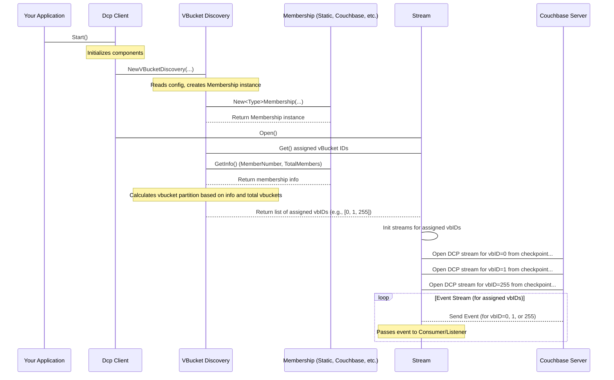

# Chapter 9: Membership / VBucket Discovery

In the [previous chapter](08_observer_.md), we looked at the internal **Observer** component, which handles the initial processing of raw DCP events for a single vBucket before passing them to the [Stream](05_stream_.md). We've also learned how the [Dcp Client](01_dcp_client_.md) is the orchestrator, how [Configuration](02_configuration_.md) tells it what to do, how your [Consumer / Listener](03_consumer___listener_.md) processes events, how [Checkpointing](06_checkpoint_.md) saves your progress, and how [Rollback Mitigation](07_rollback_mitigation_.md) handles cluster history changes.

But what if you need to process a very large stream of changes, perhaps from a busy Couchbase bucket? Running just one instance of your `go-dcp` application might not be enough to keep up with the volume of events. You might want to run *multiple* instances of your application in parallel to distribute the workload.

How do these multiple instances coordinate? How do they ensure that:

1.  They know about each other?
2.  They collectively process *all* the vBuckets in the bucket?
3.  No two instances try to process the *same* vBucket at the same time (which would cause conflicts)?

This is where the **Membership / VBucket Discovery** abstraction comes in.

Think of this as forming a **team of workers** (`go-dcp` instances) to sort a large pile of mail (DCP events from all vBuckets).

*   **Membership:** This is the process of the workers figuring out how many team members there are in total and which worker they are (Worker #1, Worker #2, etc.).
*   **VBucket Discovery:** Once a worker knows its position in the team, this is the process of deciding *which specific mailbags* (vBuckets) that worker is responsible for sorting.

The goal of Membership / VBucket Discovery is to ensure that when you run multiple instances of your `go-dcp` application, they automatically divide the vBuckets among themselves efficiently and without overlap.

## Core Concepts

The abstraction breaks down into two key ideas:

### 1. Membership

This part is about understanding the composition of the distributed `go-dcp` application group. Every instance needs to know:

*   **Total Members:** The total count of `go-dcp` instances currently running and actively participating in this group.
*   **Member Number:** The unique index or position of *this* specific `go-dcp` instance within the group (e.g., the 1st instance, the 2nd, the 3rd, and so on). This is typically a number starting from 1 up to `Total Members`.

`go-dcp` needs a way for instances to discover each other and maintain this group information.

### 2. VBucket Discovery

Once an instance knows its `MemberNumber` and the `TotalMembers` count, it can figure out which vBuckets it's responsible for.

Couchbase buckets have a fixed number of vBuckets (e.g., 1024). These vBuckets are numbered sequentially from 0 up to the total number minus 1.

`go-dcp` uses a simple, deterministic algorithm to divide these vBuckets among the members: it splits the total list of vBucket IDs (0, 1, 2, ..., 1023) into `TotalMembers` equally sized chunks. Each member is assigned one chunk based on its `MemberNumber`.

For example:
*   If there are 1024 vBuckets and 1 instance (Member #1), it gets all 1024 vBuckets (0-1023).
*   If there are 1024 vBuckets and 2 instances (Member #1 and Member #2), Member #1 gets vBuckets 0-511, and Member #2 gets vBuckets 512-1023.
*   If there are 1024 vBuckets and 4 instances:
    *   Member #1 gets vBuckets 0-255
    *   Member #2 gets vBuckets 256-511
    *   Member #3 gets vBuckets 512-767
    *   Member #4 gets vBuckets 768-1023

This simple division ensures that all vBuckets are covered exactly once across all members.

## How to Configure Membership

You configure the Membership and VBucket Discovery strategy in the `dcp.group.membership` section of your [Configuration](02_configuration_.md) file (like `config.yml`).

The crucial settings are `name` and `type`:

```yaml
# config.yml snippet
# ... other config ...

dcp:
  group:
    name: my-dcp-consumer-group # A unique name for this group of instances
    membership:
      type: static # Or 'couchbase', 'kubernetesStatefulSet', etc.
      # Other settings depending on the type...

# ... rest of config ...
```

*   `name`: This is a **required** unique identifier for the group of `go-dcp` instances that should coordinate. All instances of your application that you want to work together and share vBuckets *must* use the same group name. This name is also used internally for checkpointing (e.g., checkpoint documents in Couchbase include the group name).
*   `type`: This determines *how* the membership (`TotalMembers` and `MemberNumber`) is determined. `go-dcp` supports several types:

    *   `static`: This is the simplest type, suitable for testing or fixed deployments. You manually specify the `TotalMembers` and this instance's `MemberNumber` in the config. No automatic discovery or rebalancing happens.

        ```yaml
        # config.yml snippet for static membership
        # ... other config ...
        dcp:
          group:
            name: static-test-group
            membership:
              type: static
              totalMembers: 1 # Total instances expected in the group
              memberNumber: 1 # This instance's position (1-based index)
        # ...
        ```

        With this config, if you set `totalMembers: 2` and run two instances, you would configure one with `memberNumber: 1` and the other with `memberNumber: 2`. If you change the number of running instances or their assigned member number, you must restart them with the updated config.

    *   `couchbase`: This type enables dynamic membership discovery using Couchbase itself as a coordination service. Instances within the same `group.name` write heartbeat documents to a designated collection in Couchbase metadata (see [Chapter 6: Checkpoint](06_checkpoint_.md) where we discussed Couchbase metadata storage). `go-dcp` instances monitor these heartbeat documents to automatically discover which instances are currently alive in the group, calculate the `TotalMembers`, determine their own `MemberNumber` based on a sorted list of active instances, and dynamically rebalance vBuckets if the group size changes.
    You can take a look our detailed [article](https://medium.com/trendyol-tech/a-deep-dive-into-the-custom-membership-algorithm-of-go-couchbase-connectors-574f7314e35d) about it

        ```yaml
        # config.yml snippet for couchbase membership
        # ... other config ...
        dcp:
          group:
            name: auto-scaling-group # Same name for all instances in this group
            membership:
              type: couchbase
              # heartbeatInterval: 5s # How often to send heartbeat
              # heartbeatToleranceDuration: 10s # How long without heartbeat before considering instance dead
              # monitorInterval: 5s # How often to check for other members
              # rebalanceDelay: 5s # Delay before rebalancing after change detected
          # Also requires metadata config pointing to Couchbase for storage
          metadata:
            type: couchbase
            bucketName: my-metadata-bucket # Or same as data bucket
            scope: _default
            collection: _default
        # ...
        ```

        This is powerful for dynamic environments where instances might start or stop frequently. `go-dcp` automatically handles joining and leaving the group.

    *   `kubernetesStatefulSet`: This type is specifically for applications deployed as Kubernetes StatefulSets. StatefulSets have predictable hostnames (`<statefulset-name>-<pod-ordinal>`). `go-dcp` uses the pod ordinal (the number at the end of the hostname, starting from 0) to determine the `memberNumber` (ordinal + 1) and relies on the configured `totalMembers` for the total count.

        ```yaml
        # config.yml snippet for kubernetesStatefulSet membership
        # ... other config ...
        dcp:
          group:
            name: my-statefulset-group # Matches the StatefulSet name
            membership:
              type: kubernetesStatefulSet
              totalMembers: 3 # Must match the desired number of replicas in the StatefulSet
        # ...
        ```

        This type doesn't dynamically discover members or rebalance if the actual number of running pods deviates from `totalMembers`; it's based purely on the pod's identity within the fixed size defined by the config. It's simpler than `couchbase` for Kubernetes but less dynamic.

    *   `kubernetesHa` (High Availability): Another Kubernetes-specific type that uses a leader election mechanism (likely via Kubernetes APIs, though not detailed in the provided code) to manage dynamic membership and leader/follower roles. This is more advanced and provides high availability. (See `kubernetes/ha_membership.go`).
    *   `dynamic`: A flexible type that allows the membership information (`MemberNumber`, `TotalMembers`) to be pushed into the `go-dcp` client externally (e.g., via a custom controller or orchestrator that determines the group size and member assignment). (See `membership/dynamic_membership.go`).

For beginners, `static` is the easiest to understand and use for simple testing, while `couchbase` is the most common choice for dynamic, distributed production deployments.

## How it Works Internally

Let's trace the simplified flow when `go-dcp` starts and needs to figure out which vBuckets to stream, using the Membership/VBucket Discovery components:



Here's a breakdown of the steps:

1.  When `DcpClient.Start()` is called, it initializes the necessary components, including the `VBucketDiscovery` component.
2.  The `VBucketDiscovery` component reads the `dcp.group.membership` configuration to determine which `Membership` implementation to create (`Static`, `Couchbase`, etc.). It creates an instance of the chosen `Membership` type.
3.  Later, when the `Stream` component needs to start processing, it asks the `VBucketDiscovery` component for the list of vBuckets it should handle by calling `VBucketDiscovery.Get()`.
4.  Inside `VBucketDiscovery.Get()`, it first asks the underlying `Membership` component for its `MemberNumber` and `TotalMembers` by calling `Membership.GetInfo()`.
    *   If the type is `static`, the `Membership` component simply returns the numbers directly from the configuration.
    *   If the type is `couchbase`, the `Membership` component interacts with Couchbase metadata to discover active members and calculate these numbers dynamically. This might involve waiting briefly if the group is still forming.
    *   If the type is `kubernetesStatefulSet`, the `Membership` component calculates the member number from the hostname and uses the total from the config.
5.  Once `VBucketDiscovery` has the `MemberNumber` and `TotalMembers` from the `Membership` component, it uses the total number of vBuckets (which it gets from the [Couchbase Client](04_couchbase_client__gocbcore_wrapper__.md) during initialization) and the simple chunking logic (`helpers.ChunkSlice`) to calculate the specific range of vBucket IDs assigned to this instance.
6.  `VBucketDiscovery.Get()` returns this calculated list of vBucket IDs to the `Stream` component.
7.  The `Stream` component then proceeds to open DCP streams *only* for those specific vBuckets using the [Couchbase Client (gocbcore wrapper)](04_couchbase_client__gocbcore_wrapper__.md) and loading the correct starting [Checkpoint](06_checkpoint_.md) for each assigned vBucket.

This flow ensures that each `go-dcp` instance, regardless of the membership type, correctly identifies its slice of the vBucket pie and only processes data for those vBuckets.

## Peeking into the Code

Let's look at snippets related to Membership and VBucket Discovery.

The `Membership` interface defines the core contract:

```go
// membership/membership.go (simplified)
type Membership interface {
	GetInfo() *Model // Returns the current MemberNumber and TotalMembers
	Close()          // Cleans up membership resources
}

type Model struct {
	MemberNumber int // 1-based index of this member
	TotalMembers int // Total members in the group
}
```

The `VBucketDiscovery` interface relies on a `Membership` instance:

```go
// stream/vbucket_discovery.go (simplified)
type VBucketDiscovery interface {
	Get() []uint16 // Calculates and returns the assigned vbucket IDs
	Close()      // Closes the underlying membership instance
	GetMetric() *VBucketDiscoveryMetric // Get info for monitoring/API
}

type vBucketDiscovery struct {
	membership    membership.Membership // The underlying membership instance
	vBucketNumber int                   // Total vbuckets in the bucket
	// ... other fields (metrics) ...
}
```

The `NewVBucketDiscovery` function acts as a factory, creating the correct `Membership` implementation based on the config:

```go
// stream/vbucket_discovery.go (simplified NewVBucketDiscovery)
func NewVBucketDiscovery(
	client couchbase.Client,
	config *config.Dcp,
	vBucketNumber int, // Total vbuckets from Couchbase
	bus EventBus.Bus, // Used by dynamic memberships for communication
) VBucketDiscovery {
	var ms membership.Membership // The Membership instance

	switch {
	case config.Dcp.Group.Membership.Type == membership.StaticMembershipType:
		ms = membership.NewStaticMembership(config) // Simple static config
	case config.Dcp.Group.Membership.Type == membership.CouchbaseMembershipType:
		ms = couchbase.NewCBMembership(config, client, bus) // Uses Couchbase docs for discovery
	case config.Dcp.Group.Membership.Type == membership.KubernetesStatefulSetMembershipType:
		ms = kubernetes.NewStatefulSetMembership(config) // Uses pod hostname
	// ... other types ...
	default:
		// Handle unknown type error
	}

	// Initialize and return the vBucketDiscovery instance
	return &vBucketDiscovery{
		vBucketNumber: vBucketNumber,
		membership:    ms,
		// ... init metrics ...
	}
}
```

The core logic for assigning vBuckets is in the `vBucketDiscovery.Get()` method:

```go
// stream/vbucket_discovery.go (simplified Get method)
func (s *vBucketDiscovery) Get() []uint16 {
	// 1. Create a slice of all vbucket IDs (0 to vBucketNumber-1)
	vBuckets := make([]uint16, 0, s.vBucketNumber)
	for i := 0; i < s.vBucketNumber; i++ {
		vBuckets = append(vBuckets, uint16(i))
	}

	// 2. Get the current membership info (MemberNumber, TotalMembers)
	receivedInfo := s.membership.GetInfo()

	// 3. Use the helper function to chunk the vbuckets and get this member's chunk
	// helpers.ChunkSlice divides the slice into TotalMembers chunks
	// [receivedInfo.MemberNumber - 1] gets the chunk assigned to THIS member (adjusting for 0-based index)
	readyToStreamVBuckets := helpers.ChunkSlice[uint16](vBuckets, receivedInfo.TotalMembers)[receivedInfo.MemberNumber-1]

	// 4. Log the assigned range and update metrics
	// ... logging and metric update ...

	// 5. Return the slice of assigned vbucket IDs
	return readyToStreamVBuckets
}
```

This clearly shows how `VBucketDiscovery` depends on `Membership` to get the group size and member index, and then applies the simple slicing logic to determine its workload.

For the `couchbase` membership type (`couchbase/membership.go`), the `NewCBMembership` function starts background goroutines for `startHeartbeat()` and `startMonitor()`.

*   `startHeartbeat()`: Periodically updates a document in Couchbase metadata to signal that this instance is still alive.
*   `startMonitor()`: Periodically queries Couchbase metadata to find all instances whose heartbeats are still active, builds a sorted list of their IDs, calculates `TotalMembers` and its own `MemberNumber` based on the list, and if the membership changes, it publishes an event on the event bus.

The `kubernetesStatefulSet` membership (`kubernetes/stateful_set_membership.go`) is simpler. `NewStatefulSetMembership` calls `getPodOrdinalFromHostname()` to parse the pod index from the environment's hostname and sets the `MemberNumber` accordingly, using the configured `TotalMembers` directly.

These different implementations fulfill the `Membership` interface contract by providing the `GetInfo()` method, allowing `VBucketDiscovery` to remain simple and agnostic to *how* the membership was determined.

## Dynamic Rebalancing

For dynamic membership types like `couchbase` or `kubernetesHa`, the membership group can change while the `go-dcp` client is running (e.g., a new instance starts, or an existing one stops/crashes).

When a `couchbase` or `kubernetesHa` membership instance detects a change in the group size, it publishes an event (using the `bus` seen in `NewVBucketDiscovery` and the membership code).

The `Stream` component is subscribed to these membership change events. When the `Stream` receives a notification that the membership has changed, it triggers a **rebalance**.

Rebalancing involves:

1.  Calculating the *new* set of assigned vBuckets based on the updated membership info (`TotalMembers`, `MemberNumber`).
2.  Identifying which previously assigned vBuckets are *no longer* assigned to this instance in the new configuration.
3.  Identifying which vBuckets are *newly* assigned to this instance.
4.  Gracefully closing the DCP streams for vBuckets that are no longer assigned.
5.  Opening new DCP streams for the vBuckets that are now assigned (loading the appropriate checkpoints for these).

This automatic rebalancing ensures that as instances join or leave the group, the vBucket workload is dynamically redistributed, maintaining full coverage and adapting to changes in your application's scale or health. This adds complexity but is essential for elastic and highly available deployments.

## Conclusion

The **Membership / VBucket Discovery** abstraction is fundamental for running `go-dcp` in a distributed environment. It allows multiple instances of your application to coordinate, determine their place within the processing group (`MemberNumber` vs `TotalMembers`), and automatically figure out exactly which subset of Couchbase vBuckets they are responsible for streaming.

By configuring the appropriate `membership.type` (like `static`, `couchbase`, or `kubernetesStatefulSet`), you tell `go-dcp` how your instances should discover each other, enabling the library to correctly partition the workload using a simple division algorithm. Dynamic types further add resilience by automatically rebalancing the workload when the group composition changes.

Now that we've covered the core mechanisms from configuration and streaming to checkpointing, rollback mitigation, internal observers, and how instances coordinate, the final chapter will explore how you can monitor and interact with your running `go-dcp` client using its built-in **API**.

[Chapter 10: API](10_api_.md)

---

<sub><sup>Generated by [AI Codebase Knowledge Builder](https://github.com/The-Pocket/Tutorial-Codebase-Knowledge).</sup></sub> <sub><sup>**References**: [[1]](https://github.com/Trendyol/go-dcp/blob/f83516164dfbcc3050230193a865f051a4097d0e/couchbase/membership.go), [[2]](https://github.com/Trendyol/go-dcp/blob/f83516164dfbcc3050230193a865f051a4097d0e/kubernetes/ha_membership.go), [[3]](https://github.com/Trendyol/go-dcp/blob/f83516164dfbcc3050230193a865f051a4097d0e/kubernetes/stateful_set_membership.go), [[4]](https://github.com/Trendyol/go-dcp/blob/f83516164dfbcc3050230193a865f051a4097d0e/membership/dynamic_membership.go), [[5]](https://github.com/Trendyol/go-dcp/blob/f83516164dfbcc3050230193a865f051a4097d0e/membership/membership.go), [[6]](https://github.com/Trendyol/go-dcp/blob/f83516164dfbcc3050230193a865f051a4097d0e/membership/static_membership.go), [[7]](https://github.com/Trendyol/go-dcp/blob/f83516164dfbcc3050230193a865f051a4097d0e/stream/vbucket_discovery.go)</sup></sub>