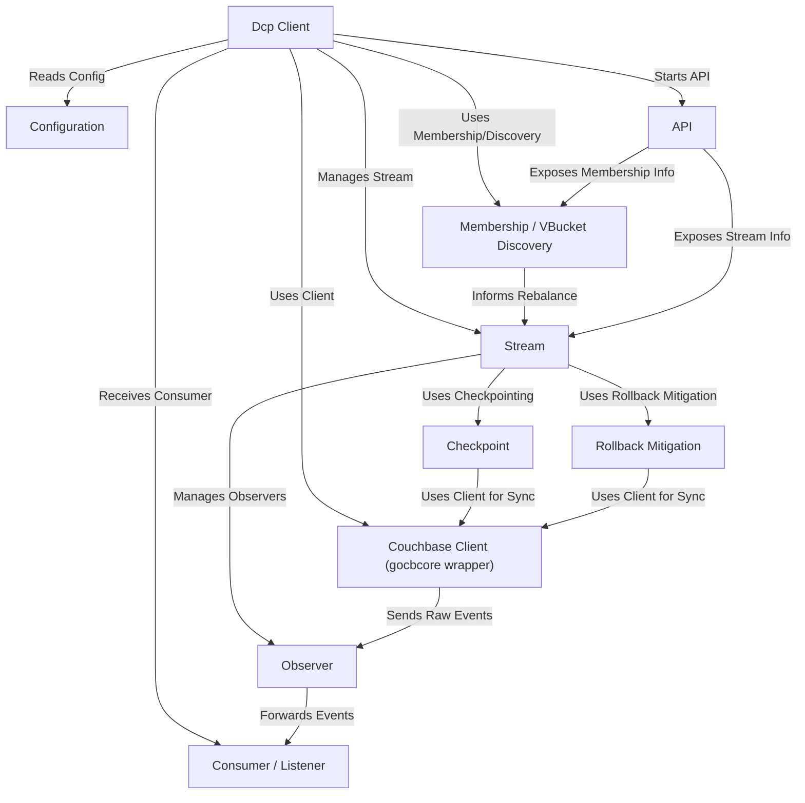

# Tutorial: go-dcp

`go-dcp` is a Go library for consuming Couchbase Database Change Protocol (DCP) feeds.
It acts as an *orchestrator* (**Dcp Client**) managing connections (**Couchbase Client**),
stream processing (**Stream**, **Observer**), user event handling (**Consumer**),
saving progress (**Checkpoint**), coordinating multiple instances (**Membership**),
and providing a management interface (**API**), while also handling complexities like rollbacks (**Rollback Mitigation**).

## Visual Overview

## Chapters

1. [Dcp Client
   ](01_dcp_client_.md)
2. [Configuration
   ](02_configuration_.md)
3. [Consumer / Listener
   ](03_consumer___listener_.md)
4. [Couchbase Client (gocbcore wrapper)
   ](04_couchbase_client__gocbcore_wrapper__.md)
5. [Stream
   ](05_stream_.md)
6. [Checkpoint
   ](06_checkpoint_.md)
7. [Rollback Mitigation
   ](07_rollback_mitigation_.md)
8. [Observer
   ](08_observer_.md)
9. [Membership / VBucket Discovery
   ](09_membership___vbucket_discovery_.md)
10. [API
    ](10_api_.md)

---

Generated by [AI Codebase Knowledge Builder](https://github.com/The-Pocket/Tutorial-Codebase-Knowledge).